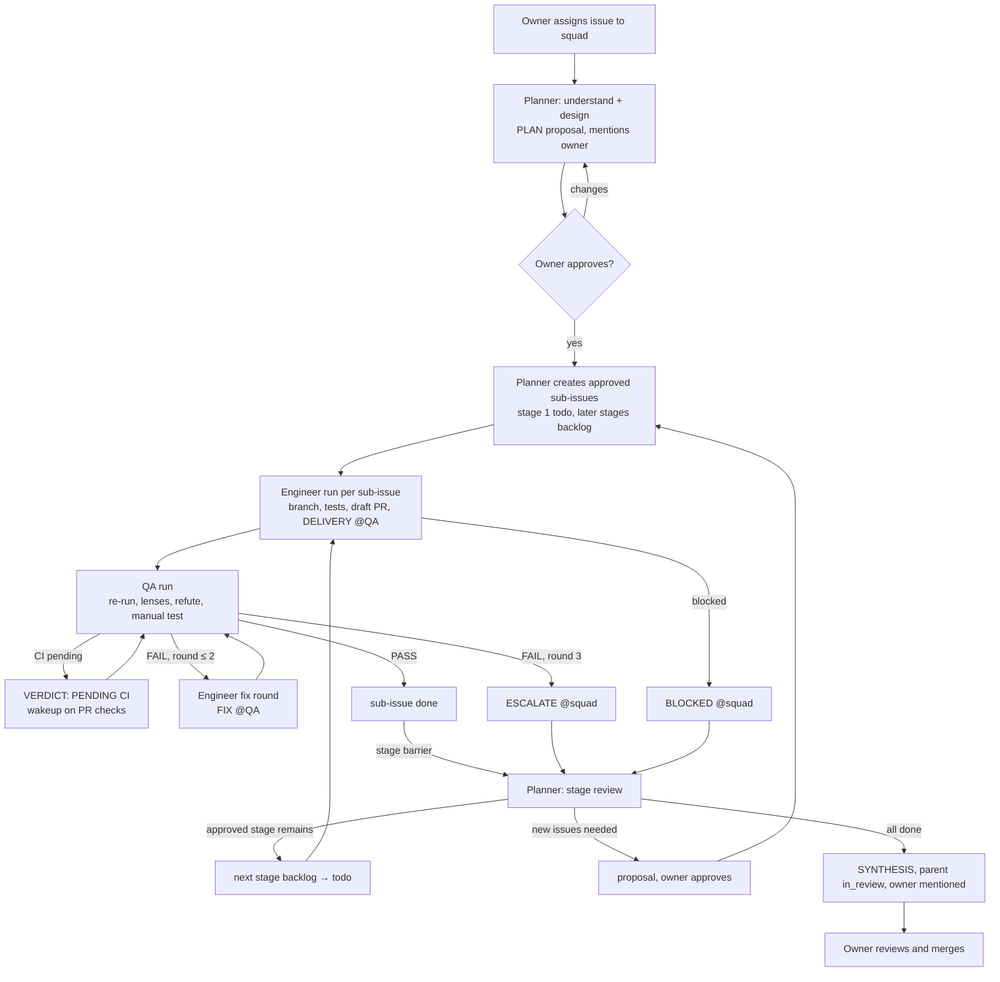

# Ultracode squad

This directory defines a three-agent [Multica](https://multica.ai) team (Planner, Engineer, QA) and the collaboration protocol it runs. The protocol reproduces the behaviour of Claude Code's **Ultracode** mode (phased orchestration, parallel fan-out, adversarial verification, completeness checks) on Multica primitives, under two constraints Ultracode does not have: **no run ever waits**, and **no agent creates an issue without the owner's approval**.

The agent prompts are project-agnostic. Everything project-specific lives in a marked `## Project: Unframework` section at the end of each skill. To use the squad on another project, replace those sections and keep the prompts.

Contents:

- `agents/` — three agent definitions with paste-ready instructions and Multica settings.
- `skills/` — three team skills in the Agent Skills format: `squad-protocol`, `adversarial-verification`, `local-verification`.

---

## The three seats

| Agent | Seat | Writes product code | Creates issues |
|---|---|---|---|
| **Planner** | Architecture, planning, triage, direction. Squad leader | Never | Only the list the owner approved |
| **Engineer** | Implementation. Owns one sub-issue end to end | Yes, inside the sub-issue scope | Never. Requests them in its reports |
| **QA** | Review, manual testing, proof | Never | Never. Requests them in its verdicts |

Five rules shape the roster:

1. **A seat is a context boundary.** The Planner holds the plan. The Engineer holds one change. QA holds the evidence. No seat holds two of these at once.
2. **Nobody grades their own work.** QA is a separate agent in a fresh session with instructions that point the opposite way from the Engineer's. Nothing reaches the owner reviewed only by its author.
3. **The owner approves the work list.** The Planner proposes sub-issues; the owner approves; the Planner creates exactly that list. Engineer and QA request issues; they never create them.
4. **Personality is an operating parameter.** The Planner is terse because planners over-plan. The Engineer is minimal because builders over-build. QA is formal because reviewers rubber-stamp.
5. **The team ships drafts.** Draft PRs plus evidence. The owner marks ready, requests human review, writes to external trackers, merges.

---

## What Ultracode does, and how the squad does it

In Claude Code, Ultracode is a standing opt-in: every substantive task becomes a workflow. The orchestrator fans work out to subagents in phases (understand, design, implement, review), verifies findings adversarially, and stays in the loop between phases. Token cost is explicitly not a constraint there. The squad keeps the structure and makes cost a first-class constraint.

| Ultracode construct | Squad mechanism | What it costs |
|---|---|---|
| Workflow script, `phase()` | The Planner's **PLAN** comment on the parent issue plus **staged sub-issues** (`--parent`, `--stage`), created after approval | One Planner run per phase boundary, plus one for the approval |
| `pipeline()` (no barrier) | Each sub-issue runs its own Engineer → QA chain independently | No run waits on a sibling |
| `parallel()` barrier | A **stage**. Multica wakes the parent's assignee when every sub-issue in the earliest open stage is `done` or `cancelled` | Zero tokens while waiting |
| `agent(..., {schema})` | **Comment contracts**: fixed headings for PLAN, DELIVERY, VERDICT, FIX, BLOCKED, STAGE REVIEW, SYNTHESIS | The Planner reads headings and thread tails, not whole threads |
| `isolation: 'worktree'` | Every run gets its own checkout from the daemon's bare-clone cache | One install and build per checkout. The dominant cost. See the cost model |
| Model and effort per stage | Model and thinking level per agent | Chosen once per seat |
| Multi-modal sweep | The Planner's recon: up to four parallel read-only subagents with different lenses, inside one run | One run, not four |
| Judge panel | The Planner's design panel: two or three in-run planning subagents with different angles, only for design-heavy issues | Zero extra runs |
| Adversarial verify (N refuters vote) | QA spawns finder subagents per lens, then a refuter subagent per finding, inside one run, on its own model. Only CONFIRMED findings block | One run per delivery |
| Loop-until-dry | Engineer ↔ QA rounds until PASS, **capped at two FAIL rounds**, then ESCALATE. The Planner settles the dispute inside its own run. Audit mode runs finder rounds inside one QA run until a round confirms nothing | Bounded by construction |
| Completeness critic | QA's VERDICT states what it did not verify. The Planner's stage review checks every criterion before the next stage | Part of existing runs |
| No silent caps | Every DELIVERY and VERDICT lists skipped checks | Free |
| Resume (cached prefix) | Multica resumes the agent's session and reuses the working directory per issue and agent | Free within the daemon's cleanup window |
| `log()` | `multica squad activity` on every leader run | One CLI call |
| `budget` | Fan-out and round caps in the PLAN; `multica issue usage` for the actual spend | Visible per issue |

---

## The protocol



### Step by step

1. **Intake.** The owner assigns an issue to the squad, or creates one with the Planner in chat. The description carries the ask and any links. Multica wakes the Planner.
2. **Planner: understand and design (one run).** The Planner reads the issue and its context. It runs recon with parallel read-only subagents (by path, by symbol, by test, by history). For design-heavy work it runs a design panel in the same run. It posts the **PLAN** as a proposal: assumptions, acceptance criteria as commands, mode, stages, one full specification per sub-issue, collision notes, non-goals, budget. It mentions the owner, moves the parent to `in_progress`, and stops. It creates nothing yet.
3. **Owner approves.** The owner replies on the parent. On approval the Planner creates exactly the approved sub-issues: stage 1 in `todo`, later stages in `backlog`. It replies under the owner's comment with the keys and sets one stall timer. On a change request it edits the PLAN in place, replies with what changed, and asks again.
4. **Engineer: implement (one run per sub-issue).** The Engineer checks out the repository, creates the branch, writes the failing test first where the criteria allow, implements, runs the focused checks from the package directory, pushes, and opens a **draft** PR. It records `branch` and `pr_url` in the sub-issue metadata, posts the **DELIVERY** with evidence, moves the sub-issue to `in_review`, and mentions QA. If blocked, it posts **BLOCKED**, sets `blocked`, mentions the squad, and stops.
5. **QA: verify (one run per delivery).** QA checks out the branch fresh and confirms it is the PR head. It re-runs every stated command and reads the tests before the code. It runs finder subagents (correctness, scope, security, and one per project review-rule group that matches the diff), then a refuter subagent per finding. For UI or behaviour changes it drives the flow on an isolated instance and attaches screenshots. It registers a wakeup on the PR checks, then reads them; if they are pending it posts `VERDICT: PENDING CI` and stops. It replies under the comment that woke it with the **VERDICT**. PASS moves the sub-issue to `done`. FAIL mentions the Engineer. The third FAIL becomes ESCALATE and mentions the squad.
6. **Engineer: fix round.** The Engineer resumes, fixes the CONFIRMED findings only, pushes, and replies **FIX** under the VERDICT with the QA mention. It may disagree with a finding, with evidence.
7. **Planner: stage review (one run per stage).** The stage barrier wakes the Planner. It reads `issue children` and each child's last VERDICT, checks the criteria, and collects issue requests and skill amendments from the reports. It moves the next approved stage from `backlog` to `todo`. Anything that needs a new issue becomes a proposal in the **STAGE REVIEW**, with the owner mentioned; the Planner creates it only after approval. When the last stage closes it posts the **SYNTHESIS** (PRs in merge order, evidence, open questions, skipped checks, proposed amendments, usage), deletes the stall timer, moves the parent to `in_review`, and mentions the owner.
8. **Owner.** Reviews, marks ready, merges, and applies any approved skill amendments.

### Modes the Planner picks at planning time

| Mode | When | Shape |
|---|---|---|
| **Single** | One package, one agent-day, no independent slices | One stage, one sub-issue. The pipeline with no fan-out. Default |
| **Fan-out** | Two or more slices that touch disjoint paths, or a contract-first dependency | Stages: contract before consumers; independent slices share a stage |
| **Audit** | "Find the bugs in X", "review this area" | Stage 1: one QA-owned sub-issue; finder and refuter subagents run inside it, round after round, until a round confirms nothing. QA posts the AUDIT REPORT and marks it done. Stage 2: Engineer fix sub-issues for CONFIRMED findings, proposed in the stage review and created after approval |

### Rules that keep it cheap

- **The Planner never waits and never polls.** It wakes on assignment, owner comments on the parent, stage barriers, squad mentions, failed child runs, and one stall timer. Traffic on sub-issues does not wake it, because sub-issues are assigned to the Engineer or QA, not to the squad.
- **Bounded reads.** Agents scan with `--roots-only --summary` and open one thread with `--tail`. Nobody reads a full timeline.
- **One comment per run, under the trigger.** Multica rejects a reply that is not under the comment that woke the run. Agents edit earlier comments in place instead of posting again.
- **Fan out on disjoint paths only.** Every checkout pays an install and a build. Slices that collide on shared files go into ordered stages instead.
- **In-run subagents for read-only work.** Recon, lens reviews, refutation, and design panels run inside one Multica run. Only work that changes files or needs an independent reviewer becomes a sub-issue.
- **QA waits on CI with a wakeup, not a loop.** It registers the wakeup first, then reads the checks, and deletes the wakeup if the checks already finished.
- **Two FAIL rounds, then escalate.** The Planner settles the dispute in its own run. No third opinion, no extra sub-issue.
- **One stall timer per parent.** The Planner moves it forward with `wakeup update` and deletes it at SYNTHESIS. Timers that pile up keep firing.
- **Concurrency caps protect the machine.** Engineer 3, QA 2, Planner 2.
- **Shared build cache.** Every agent sets `TURBO_CACHE_DIR` to one absolute path so checkouts share build artifacts. Same-agent runs on the same issue reuse the working directory until the daemon's cleanup removes `node_modules` after 12 hours.

### Definition of done (sub-issue)

1. Every acceptance criterion in the sub-issue is met, with commands and outcomes in the DELIVERY.
2. Tests exist for new behaviour. QA re-ran them and they pass from the package directory.
3. The package's typecheck and lint pass in every touched package.
4. The project's conventions hold (the project section of `squad-protocol` lists them).
5. Draft PR: title rules, template, ticket references, nothing that must not be public. CI green or listed as pending.
6. QA posted PASS. Nothing changed outside the sub-issue scope.

---

## Cost model

| Cost centre | Driver | Knob |
|---|---|---|
| Checkout setup | One install and build per fresh checkout. QA pays its own for every sub-issue | Shared `TURBO_CACHE_DIR`; offline installs; build only the touched packages; prefer Single mode |
| Engineer runs | One per sub-issue plus one per fix round | Smaller sub-issues; tests first so the first round is right; round cap; `high` effort so a round is not wasted on a sloppy delivery |
| QA runs | One per delivery plus one per CI wakeup | Refuters instead of re-review; mutation testing only as a tiebreak; CI wakeup instead of polling |
| Planner runs | One per phase boundary, one per approval, observe-only wakes | Sub-issues assigned to Engineer or QA directly; observe-only turns post nothing and stop |
| Context size | Comment history | Bounded reads; comment contracts; metadata for durable facts |
| Parallelism | Concurrent checkouts on one machine | Agent concurrency caps; fan-out rule |

Read the actual spend with `multica issue usage <parent>` and on each child. The Planner includes the totals in the SYNTHESIS.

What the squad deliberately does **not** copy from Ultracode: N-way voting by separate runs, loop-until-dry on every task, design panels on small issues, and isolation for read-only work.

---

## Setting it up in Multica

1. **Upgrade Multica.** Issue wakeups shipped in 0.5.1; the `--until-*`, `--expires-in` and `--on-timeout` flags in 0.6.0. The self-hosted server and the Desktop app (which bundles the daemon and the CLI that runs inside agent runs) were both 0.5.0. Upgrade both to 0.6.1 or later. Staged sub-issues have worked since 0.3.28.
2. **Pick the workspace's issue prefix**, such as `MUL`. The prefix goes into branch names, so it must not be the key of another tracker that links branches by key.
3. **Create the project** with one resource: `github_repo` `git@github.com:uxfront-com/unframework.git`, ref `main`. Do not use a `local_directory` resource; in worktree mode it replays the human's uncommitted edits into every agent checkout.
4. **Install a GitHub App on `uxfront-com`** (an org owner must approve). Self-hosted Multica links PRs, shows CI, and fires `--until-pr checks` only through a GitHub App. Without it the squad falls back to `gh` and timers (the project section of `adversarial-verification` describes the fallback).
5. **Import the three team skills from local archives.** Zip each directory under `skills/` and run `multica skill import --file <skill>.zip`. For later updates use `--on-conflict overwrite`; it keeps the skill's id and agent bindings. No fork or personal repo is needed.
6. **Import the project's shared skills, if it has any.** Unframework ships none today; agents read its `AGENTS.md` explicitly instead. The checkout's own `.claude/` configuration never loads in a run, so skills reach agents only through Multica. When the project adds skills, import them by URL so `multica skill refresh` tracks `main`, and list which skill goes to which agent in the project section of `squad-protocol`.
7. **Create the three agents** from `agents/`: name, runtime Claude Code, paste the instructions, attach the skills, set model, thinking level, concurrency, and environment from each file's table. Access: Only me.
8. **Create the squad.** Name `Ultracode`, leader Planner, members Engineer and QA with the role descriptions from their files. Squad instructions:

   ```text
   The owner is Alex. Propose sub-issues in the PLAN and create them only after Alex approves, assigned to Engineer (or QA for audits), never by @-mentioning members on the parent. Engineer mentions QA on delivery. QA marks a verified sub-issue done. You wake on stage barriers, Alex's comments, squad mentions, failed child runs, and your one stall timer. Follow your instructions and the squad-protocol skill.
   ```
9. **Smoke test.** Assign one small, real issue to the squad in Single mode and read every comment the team posts. Fix the instructions before the second issue.
10. **Skill amendments.** Agents cannot edit skills; they propose amendments in their reports and the Planner lists them in the SYNTHESIS. Apply them by editing the skill directory here and re-importing with `--on-conflict overwrite`.

---

## Adapting the squad to another project

Keep `agents/` as is. In each skill, replace the `## Project: Unframework` section: repository URL and checkout directory, contributor guide paths, commit and PR rules, collision map, review-rule groups, verification commands and traps, and the list of project skills per agent.

---

## Open points for the owner

- **QA model.** `claude-fable-5-1` runs on this runtime at about two and a half times the price of Opus 5.5. QA's finder and refuter subagents inherit its model, so this is the most expensive seat to upgrade and the one where recall matters most.
- **GitHub App on `uxfront-com`.** Needs an org owner. Until then, CI waits use the `gh` fallback.
