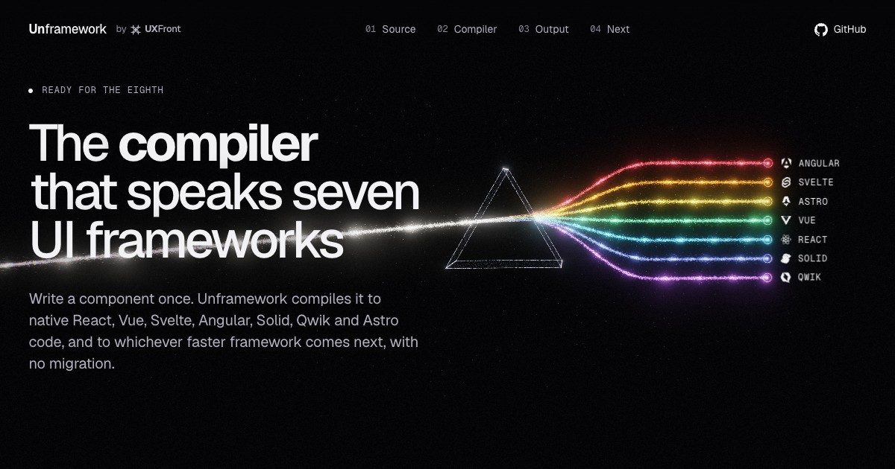

    

<h1 align="center">Unframework</h1>

    Unframework is the compiler that speaks seven UI frameworks: write a component once, and it compiles to native React, Vue, Svelte, Angular, Solid, Qwik and Astro code, and to whichever faster framework comes next, with no migration.   Unframework is part of <a href="https://uxfront.com">UXFront</a>, written and maintained by <a href="https://github.com/alexgrozav">@alexgrozav</a>.
     
     
     
    
     
     
     
    <a href="https://unframework.dev">Homepage</a>
    ·
    <a href="https://unframework.dev/docs">Documentation</a>
    ·
    <a href="./.github/CONTRIBUTING.md">Contributing</a>
    ·
    <a href="https://github.com/uxfront-com/unframework/issues">Issue Tracker</a>

 

    
    

 
 

## Table of contents

- [How it works](#how-it-works)
- [The eighth framework](#the-eighth-framework)
- [Status](#status)
- [Part of UXFront](#part-of-uxfront)
- [Bugs and feature requests](#bugs-and-feature-requests)
- [Contributing](#contributing)
- [Creator](#creator)
- [Copyright](#copyright)

## How it works

One beam of light goes into a prism and comes out as seven. Unframework does the same with your
components: one source goes into the compiler and comes out as seven frameworks.

- **Source**: one component is the source of truth for every framework. Change it in one place,
  and all seven get the change on the next build. _One source, no drift, one standard,
  agent-ready._
- **Compiler**: the compiler reads what your component does, then writes it the way each framework
  expects: hooks in React, refs in Vue, runes in Svelte, signals in Solid. _Idiomatic, consistent,
  build-time, deterministic._
- **Output**: each framework gets a real component in its own format, typed and readable, with no
  wrapper or adapter in between. _React, Vue, Svelte, Angular, Solid, Qwik and Astro._

Props, events and slots keep their names in every framework, so a component reads the same
wherever you use it. Meet the [Open Components](https://opencomponents.dev) standard once, and
every output meets it.

## The eighth framework

AI is speeding everything up, and a faster framework is always around the corner. When it lands,
it's one more compile target: your components move on the next build, not in a migration.

- **No migration**: a new framework is a new compile target, not a rewrite of every component.
- **No bet to make**: don't guess which framework wins. Your components go where it goes.
- **Side by side**: ship the old framework and the new one from the same source while you move.
- **On your schedule**: switch when the numbers say so, not when a rewrite fits the roadmap.

## Status

Unframework is in early development, and the compiler isn't published yet. Watch this repository
to hear when the first release lands, and read the [documentation](https://unframework.dev/docs)
as it grows with it.

## Part of UXFront

Unframework is one of the [UXFront](https://uxfront.com) projects, which share one foundation:

- [Open Components](https://opencomponents.dev): the standard for perfect UI components.
- [Styleframe](https://styleframe.dev): the styling engine.
- [Inkline](https://inkline.io): the UI library.

## Bugs and feature requests

Found a bug, or have an idea for the compiler or a framework it should speak? Please first search
for existing and closed issues. If your problem or idea is not addressed yet,
[please open a new issue](https://github.com/uxfront-com/unframework/issues/new/choose).

## Contributing

Please read through our [contributing guide](./.github/CONTRIBUTING.md). There you can find how
the monorepo is laid out, how to run the site locally, how to add a package and how releases work.

Thanks goes to these [wonderful people](https://github.com/uxfront-com/unframework/graphs/contributors)!

## Creator

### **Alex Grozav**

- <https://github.com/alexgrozav>
- <https://uxfront.com>

If you use Unframework in your daily work and feel that it has made your life easier, please
consider sponsoring me on [GitHub Sponsors](https://github.com/sponsors/alexgrozav). 💖

## Copyright

Copyright © 2026 [UXFront](https://uxfront.com).
