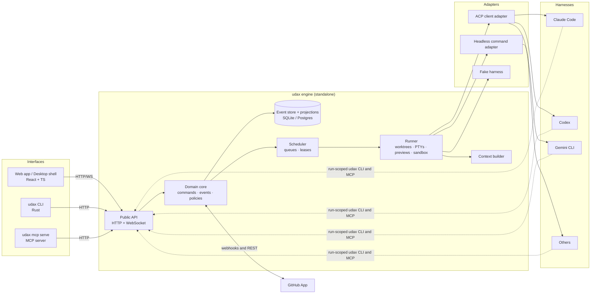
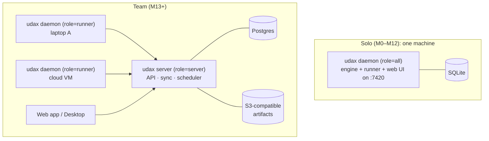
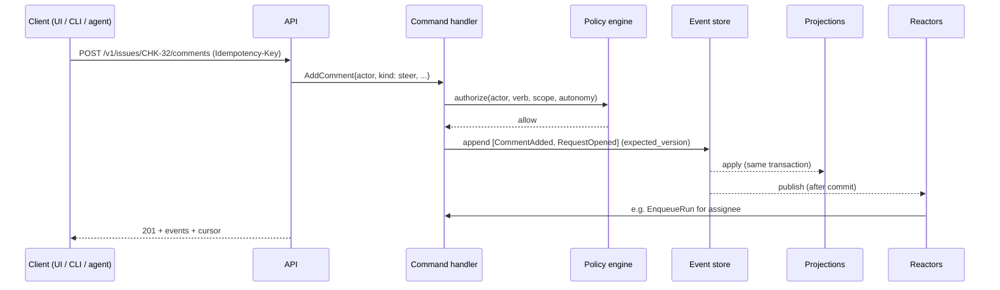
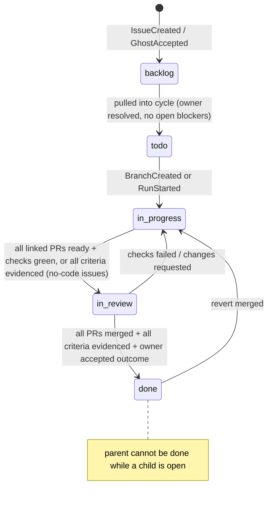
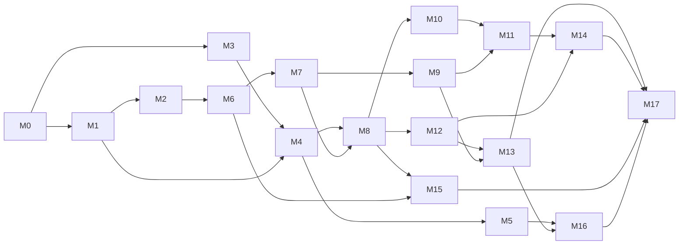

# UDAX implementation plan

Status: Draft for review · Date: 2026-09-30 · Owner: Alex Grozav (Operator)
Source proposal: [`udax-deck/`](../../udax-deck/index.html) (36 slides, “UI and UX design proposal”)
Decision records: [`docs/adr/`](../adr/README.md) (decided) · [`docs/rfc/`](../rfc/README.md) (awaiting a decision)

---

## 1. Summary

UDAX ships as three layers:

1. **The engine** (`udax-engine`): a standalone, agent-agnostic service. It holds the issue graph as an event log, schedules agent runs, manages git worktrees, terminals, and previews, and enforces ownership, autonomy, and budgets. It knows nothing about any particular coding agent. Harnesses (Claude Code, Codex, Gemini CLI, and others) plug in through **adapters**. The default adapter speaks the Agent Client Protocol (ACP).
2. **Interfaces**: the **CLI** (`udax`) and the **UI** (web app, later a desktop shell) are clients of the engine’s public API. Neither contains business rules. An **MCP server** is a third, thin interface for harnesses that prefer tools over a shell.
3. **Adapters and integrations**: harness adapters, git hosting (GitHub first), sandbox providers, and preview providers. Each sits behind a trait so it can be swapped without touching the engine core.

The plan has **18 milestones (M0–M17)** over about **44 calendar weeks** for a team of six plus agents. Each milestone ends in a demo, a review package, and testable exit criteria. An agent completes its first issue end to end in **M2 (week 8)**. The team starts building UDAX with UDAX after **M8 (week 18)**. Private beta follows **M13 (week 30)**, and GA follows **M17 (week 44)**.

The recommended stack is **Rust** for the engine and CLI (one static binary, fast startup for agents that call the CLI constantly) and **TypeScript/React** for the UI. Everything else follows from that. This choice and four others are open RFCs (§4). Each has a steelmanned alternative and a decision point in M0.

---

## 2. Goals, non-goals, success measures

### Goals
- Implement every concept in the deck: the issue graph canvas with semantic zoom, the five statuses, owners and assignees, configurable agents, the issue room (Conversation, Activity, Code, Preview, Terminal), review by evidence, many-repo changesets, autonomy, and the `udax` CLI.
- Keep the engine **standalone and agent-agnostic**: it can run headless on a laptop or a server, and adding a new harness is an adapter, not an engine change.
- Hold the product to a **Linear-grade** bar for speed, keyboard flow, and visual calm.
- Make every milestone **reviewable** (small PRs, a demo, a checklist) and **achievable** (2–8 weeks, a named lane, no hidden dependencies).

### Non-goals (v1)
- Hosting models or running inference. UDAX orchestrates harnesses and never calls model APIs directly, except through a harness.
- Replacing the code editor for deep editing sessions. The room’s Code view covers review and quick edits, and “Open in editor” hands off to VS Code, Zed, Cursor, or JetBrains.
- Git hosting beyond GitHub before GA. GitLab and Bitbucket arrive as integration adapters after v1.
- Mobile apps. Answering needs-you from a phone works through notifications and the responsive web app.

### Success measures (instrumented from M8 onward)
| Signal | Definition | Target at GA |
|---|---|---|
| Intent to merged PR | Median time from a node’s creation to its first merged PR | 30% faster than the team’s previous tracker on dogfood data |
| Reviews decided on evidence | Share of approvals made without expanding every diff group, with no rise in reverts | ≥ 50% |
| Time to answer an agent | Median time a needs-you beacon waits on its owner | < 30 min during working hours |
| Run success without human edits | Share of agent runs whose PRs merge without a human commit | Tracked, not targeted, until a baseline exists |
| Interaction latency | INP p75 in the web app | < 100 ms |

---

## 3. Fixed decisions (ADRs)

These came from the Operator and are treated as constraints.

| ADR | Decision |
|---|---|
| [0001](../adr/0001-standalone-agent-agnostic-engine.md) | The engine is standalone and agent-agnostic. Harnesses integrate through adapters. |
| [0002](../adr/0002-ui-and-cli-are-engine-interfaces.md) | The UI and CLI are interfaces to the engine, with no business logic of their own. |
| [0003](../adr/0003-linear-inspired-visual-language.md) | The product UI follows a Linear-inspired visual language. |
| [0004](../adr/0004-one-owner-many-assignees.md) | Every issue has exactly one owner, always a person, and any number of assignees, who can be people or agents. |
| [0005](../adr/0005-agents-can-read-any-conversation.md) | Agents can read any issue and its conversation. |
| [0006](../adr/0006-cli-conventions-follow-multica.md) | The CLI follows noun-verb grammar and conventions adapted from the Multica CLI. |
| [0007](../adr/0007-steering-through-the-issue-conversation.md) | People steer agents through comments in the issue’s conversation. Agents answer in the same thread. |
| [0008](../adr/0008-agents-are-configured-by-prompt-model-effort.md) | Agents are configured by a versioned system prompt, a model, and an effort level. |

## 4. Proposed decisions (RFCs, due in M0 week 1)

| RFC | Question | Class | Recommendation |
|---|---|---|---|
| [0001](../rfc/0001-engine-language-and-runtime.md) | Which language and runtime for the engine and CLI? | 3 | Rust (tokio, axum, sqlx) for the engine and CLI, TypeScript for the UI |
| [0002](../rfc/0002-harness-adapter-protocol.md) | How do harnesses connect? | 3 | ACP as the default wire protocol behind an internal `HarnessAdapter` trait, with MCP and the `udax` CLI as the agent’s tools |
| [0003](../rfc/0003-persistence-and-sync.md) | How is state stored and synced to clients? | 3 | Event-sourced engine (SQLite locally, Postgres for teams) with a custom snapshot-plus-delta sync protocol |
| [0004](../rfc/0004-desktop-shell.md) | Which desktop shell? | 2 | Web-first; Tauri 2 in M17, with Electron as the fallback |
| [0005](../rfc/0005-canvas-rendering.md) | How is the canvas rendered? | 2 | React Flow for card altitudes plus a PixiJS layer for dot and pill altitudes, with ELK layout in a worker |

---

## 5. Architecture

### 5.1 System context



**The dependency rule**: interfaces depend on the public API, the API depends on the domain core, and the core depends on nothing but traits (store, runner, harness, git host, sandbox, clock). Every adapter lives outside the core and is wired in at the binary’s edge. A lint (`cargo deny` bans plus `cargo-modules` checks) keeps domain crates from importing IO crates.

### 5.2 Deployment topologies



- **One binary.** `udax` holds the CLI and the engine. `udax daemon start` runs the engine locally, `udax server` runs team mode, and `udax daemon start --role runner` connects a machine to a team server. The same code path serves both modes.
- **Runtimes** (the Multica pattern): a runner detects installed harnesses and registers them. Work is dispatched to a runtime that has the agent’s harness and is online.

### 5.3 Inside the engine: commands, events, projections, reactors



- **Commands** are validated intents. **Events** are immutable facts with a workspace-wide sequence number. **Projections** are read models updated in the same transaction as the append, so reads are consistent after a write. **Reactors** are automations: status transitions, run enqueueing, escalations, budgets, and collision detection. Reactors issue commands, never raw writes.
- Everything the product shows as history (Activity, Replay, Requests, audit) is a query over events. Nothing is logged twice.

### 5.4 Repository layout

```
udax/
├─ Cargo.toml                      # Rust workspace
├─ package.json · pnpm-workspace.yaml · turbo.json
├─ mise.toml                       # pins rust, node, pnpm, just
├─ justfile                        # dev, ci, gen, e2e, bench
├─ crates/
│  ├─ udax-domain/                 # pure types, state machines, policies (no IO)
│  ├─ udax-store/                  # event store + projections (sqlx: SQLite, Postgres)
│  ├─ udax-engine/                 # command handlers, reactors, scheduler, context builder
│  ├─ udax-runner/                 # worktrees, processes, PTYs, previews, sandbox providers
│  ├─ udax-adapters/               # HarnessAdapter trait, ACP client, headless, fake
│  ├─ udax-integrations/           # GitHub App (octocrab), later GitLab
│  ├─ udax-api/                    # axum HTTP + WS, OpenAPI (utoipa), auth, sync
│  ├─ udax-mcp/                    # MCP server (rmcp)
│  ├─ udax-client/                 # typed Rust client used by the CLI
│  ├─ udax-cli/                    # clap command tree, output formatting
│  └─ udax/                        # the one binary: CLI + daemon + server entrypoints
├─ apps/
│  ├─ web/                         # React app (served by the engine in solo mode)
│  ├─ desktop/                     # Tauri 2 shell (M17)
│  └─ docs/                        # Starlight docs site
├─ packages/
│  ├─ tokens/                      # DTCG JSON, theme generator, Style Dictionary build
│  ├─ ui/                          # design-system components
│  ├─ icons/                       # status glyphs, agent hex, curated Lucide subset
│  ├─ client/                      # generated TS types + API client + sync client
│  ├─ canvas/                      # graph view, layout worker, WebGL layer
│  └─ config/                      # tsconfig, biome, vitest presets
├─ harnesses/
│  ├─ manifests/                   # adapter manifests (TOML) per harness
│  └─ fake/                        # scripted ACP agent for deterministic tests
├─ tests/
│  ├─ e2e/                         # Playwright journeys against a real engine
│  ├─ scenarios/                   # engine Given/When/Then scenarios
│  └─ fixtures/                    # repos, event logs, recorded ACP transcripts
└─ docs/
   ├─ plan/ · adr/ · rfc/
   └─ deck/                        # the UDAX design deck (moved from udax-deck/)
```

---

## 6. Technology stack

Each choice names what it replaces and why. “Industry standard” here means widely adopted, actively maintained, and proven in comparable products.

### 6.1 Engine and CLI (Rust; see RFC-0001)
| Area | Choice | Why |
|---|---|---|
| Async runtime and HTTP | tokio, axum 0.8, tower, tower-http | De facto Rust server stack; composable middleware (auth, tracing, limits) |
| Persistence | sqlx 0.8 with SQLite (WAL) and Postgres 17+ | Compile-time checked SQL, one API for both backends, built-in migrations |
| Serialization and schema | serde, schemars | JSON Schema for events and CLI output contracts |
| API contract | utoipa (OpenAPI 3.1) + oasdiff in CI | Spec generated from handlers, breaking changes caught in review |
| TS type sharing | ts-rs | Rust types are the single source of truth for TS types |
| Git | `git` CLI for worktree, rebase, and merge; gix (gitoxide) for fast reads | Porcelain for correctness on writes, gix for status, diff, and blame at speed |
| PTY | portable-pty (from WezTerm) | Cross-platform PTYs, battle-tested |
| File watching | notify | Implicit file claims and collision detection |
| ACP | `agent-client-protocol` crate (official) | Engine acts as an ACP client |
| MCP | `rmcp` (official Rust MCP SDK) | Exposes the same verbs as MCP tools |
| GitHub | octocrab plus webhook signature verification | Mature client; the GitHub App model scales and uses scoped installation tokens |
| Run tokens | PASETO v4 (`pasetors`) | Short-lived, scoped, run-bound tokens with no JWT algorithm pitfalls |
| Auth (team) | `openidconnect`, tower-sessions, RFC 8628 device flow for `udax login` | Standard OIDC with GitHub and Google |
| CLI | clap 4 (derive), clap_complete, clap_mangen, comfy-table, miette | Fast parsing, completions, man pages, readable diagnostics |
| Observability | tracing, tracing-opentelemetry, OTLP exporter; Sentry | Traces per run and command; one pipeline locally and in the cloud |
| Testing | cargo-nextest, insta (snapshots), proptest, trycmd (CLI), wiremock, criterion | Fast, deterministic, property-based where invariants matter |
| Supply chain | cargo-deny, cargo-machete, cargo-cyclonedx (SBOM) | Licenses, advisories, unused deps, SBOM |
| Release | dist (cargo-dist), git-cliff, cosign | Installers, Homebrew tap, signed artifacts, changelog |

### 6.2 UI (TypeScript)
| Area | Choice | Why |
|---|---|---|
| Framework and build | React 19, Vite 7, TypeScript (strict) | Largest ecosystem; fast HMR |
| Routing and server state | TanStack Router, TanStack Query | Type-safe routes and search params; cache primitives |
| Client store | TanStack DB with a custom UDAX sync collection. Fallback: a MobX object pool, as Linear uses | Normalized collections, live queries, optimistic transactions. Decided by a spike in M4 because TanStack DB is pre-1.0 |
| Persistence | Dexie 4 (IndexedDB) | Instant warm start, offline tolerance |
| Primitives | Radix Primitives, cmdk, Floating UI, react-resizable-panels | Accessible behavior without imposed styles; cmdk is the canonical ⌘K |
| Styling | Tailwind CSS v4 over CSS variables from `packages/tokens`; tailwind-variants | Tokens in CSS variables enable runtime theming; utilities stay token-bound |
| Motion | Motion (formerly Framer Motion) | Layout and presence animation, reduced-motion aware |
| Canvas | @xyflow/react 12 (React Flow), PixiJS 8, elkjs in a Web Worker (Comlink) | DOM for rich cards, GPU for scale, a proper layered layout |
| Code | CodeMirror 6, @codemirror/merge, Shiki for read-only highlighting | Light, extensible, strong diff support |
| Terminal | @xterm/xterm 5 with the WebGL and fit addons | The standard web terminal |
| Lists | TanStack Virtual | 10k-row lists at 60 fps |
| Icons | Lucide (curated subset) plus custom status glyphs | Consistent stroke and size; few icons, per Linear’s latest refresh |
| Tokens | W3C DTCG JSON, Style Dictionary 4, culori (OKLCH) | Standard token format; perceptual theme generation |
| Testing | Vitest 3, Testing Library, Storybook 9 (interaction tests), Chromatic, Playwright, @axe-core/playwright, MSW 2, fast-check | Unit to E2E, visual review, and a11y in CI |
| Lint and format | Biome 2 | One fast tool for lint and format |
| Desktop (M17) | Tauri 2 (see RFC-0004) | Small, secure, shares Rust with the engine |

### 6.3 Platform
| Area | Choice |
|---|---|
| Monorepo | Cargo workspace + pnpm 10 workspaces + Turborepo; `mise` for toolchains; `just` for tasks; lefthook for git hooks |
| CI | GitHub Actions with sccache, Turborepo remote cache, nextest partitioning, Playwright sharding |
| Dependencies | Renovate (grouped, weekly), cargo-deny, `pnpm audit` |
| Docs | Starlight (Astro); CLI reference generated from clap; API reference from OpenAPI via Scalar |
| Artifacts | S3-compatible object storage (MinIO locally, R2 or S3 hosted) |
| Fanout (team) | Postgres LISTEN/NOTIFY; NATS JetStream if fanout outgrows it (revisit trigger in RFC-0003) |
| Monitoring (hosted) | OpenTelemetry to Grafana (Tempo, Loki, Prometheus) or Honeycomb; Sentry for errors |
| Sandboxing | macOS Seatbelt profiles, Linux bubblewrap and Landlock, containers (Docker/Podman). Remote microVM providers go behind a `SandboxProvider` trait |

---

## 7. Domain model

### 7.1 Entities
| Entity | Key fields | Notes |
|---|---|---|
| Workspace | id, slug, name, settings | Tenant boundary. Every row and event carries `workspace_id` |
| Member | id, person, role (admin, member, guest) | People only |
| Project | id, key prefix (`CHK`), name, lead | Issue keys are `PREFIX-N` |
| Issue | id, key, title, intent, status, parent_id, owner_id?, assignees[], repos[], autonomy?, budget?, archived_at | `owner_id` and `autonomy` are nullable and inherited when null (§7.2) |
| Dependency | from_issue, to_issue (blocks) | Cycles rejected |
| Criterion | id, issue_id, text, order, evidence_state | Acceptance criteria |
| Evidence | id, criterion_id, kind (test, screenshot, recording, log_query, manual), artifact_ref, by (actor), run_id? | Proves a criterion |
| Ghost | id, parent_id, title, why, repos[], estimate, proposed_by_run, state (proposed, accepted, dropped), drop_reason | Accepted ghosts become Issues |
| Comment | id, issue_id, thread_id, kind (steer, note, reply, ask, system), body, anchor?, author (actor) | Anchors: code line, preview pin, terminal selection |
| Request | id, comment_id, issue_id, assignee, state (queued, in_progress, done, declined), resolution (commit, pr, comment) | Created from steer comments to an assignee |
| Decision | id, issue_id, comment_id, text, decided_by | Flows into the context of the issue and its sub-issues |
| Ask | id, issue_id, from_run, to_person, question, options[], answer?, escalations[] | The “needs you” object. ACP permission requests become asks when policy says “ask” |
| Agent | id, name, role, current_prompt_version, model, effort, harness, access{repos, verbs}, defaults{autonomy, budget}, archived_at | Configured teammate |
| PromptVersion | agent_id, version, text, author, created_at | Immutable; runs record the version they used |
| Run | id, issue_id, agent_id, prompt_version, model, effort, harness+version, runtime_id, state, started_at, ended_at, usage{tokens_in, tokens_out, cost_minor, currency}, context_snapshot_ref | Every attempt, with full provenance |
| RunStep | run_id, seq, kind (message, thought, tool_call, plan, permission), payload | Mirrors ACP session updates |
| Repository | id, provider, owner/name, default_branch, local_path?, conventions_ref | Registered per workspace |
| Branch / Worktree | issue_id, repo_id, name (`chk-32/wallet-buttons`), path, runtime_id | One branch name per issue across repos |
| FileClaim | repo_id, path, holder (run or person), mode (agent_write, human_edit_lock), expires_at | Collision detection |
| PullRequest | id, repo_id, number, issue_ids[], state, draft, checks{…}, reviews{…}, stacked_on? | Mirrored from the git host |
| Changeset | id, issue_id, prs[] ordered, state (forming, merging, paused, merged, reverted) | Multi-repo merge train |
| Preview | id, changeset_or_issue, url, state, processes[] | Local process group or remote provider |
| Pin | id, preview_id, coords, screenshot_ref, comment_id | Pinned comment on a preview |
| Runtime | id, name, host, harnesses[] (detected, versions), state (online, offline), last_heartbeat | Where runs execute |
| TerminalSession | id, worktree_id, owner (run or person), pty ref, recording_ref | Streams, not events. Recordings are artifacts |

### 7.2 Inheritance rules (computed in projections, never stored twice)
- **Owner**: `owner_id` if set, otherwise the nearest ancestor’s owner. The root issue of a project must have an owner (the project lead by default). Invariant: the resolved owner is always a person (ADR-0004).
- **Autonomy**: the explicit level if set, otherwise the nearest ancestor’s. A child can be **stricter** than its parent, never looser than the **ceiling**. The ceiling is the minimum of the workspace ceiling and any protected-path ceiling on repos in scope.
- **Repos**: a sub-issue starts with its parent’s repos and may narrow them. It can add a repo only with the owner’s approval.
- **Decisions**: the decisions on an issue and all its ancestors enter the context of runs on that issue.

### 7.3 Identifiers and keys
- Internal IDs are prefixed ULIDs: `iss_01J…`, `run_…`, `agt_…`, `cmt_…`, `req_…`, `evt_…`, `ws_…`.
- Issue keys like `CHK-32` are accepted anywhere an issue ID is, in both the API and the CLI (ADR-0006: keys, not IDs). `--full-id` prints ULIDs.

---

## 8. Engine design

### 8.1 Event store
- Table `events(workspace_id, seq BIGINT, aggregate_type, aggregate_id, aggregate_version, type, schema_version, actor, causation_id, correlation_id, payload JSONB, occurred_at)` with a unique `(workspace_id, seq)` and a unique `(aggregate_id, aggregate_version)` for optimistic concurrency.
- Appends run inside one transaction with the projection updates. Publishing to reactors and the sync stream happens after commit, using an outbox table for at-least-once delivery. Consumers are idempotent by `seq`.
- **Upcasting**: every event type is versioned. Upcasters in `udax-domain` transform old payloads on read, and the store is never rewritten. Replay tests run on a golden 50k-event fixture.
- **Snapshots** for aggregates whose event count exceeds 500 (runs with many steps). RunSteps live in their own table (append-only) and are referenced from `RunStepRecorded` batch events to keep the log lean.

### 8.2 Event catalog (v1)
| Group | Events |
|---|---|
| Workspace | `WorkspaceCreated`, `MemberJoined`, `MemberRoleChanged`, `ProjectCreated`, `RepositoryConnected` |
| Issue | `IssueCreated`, `IssueUpdated`, `IssueMoved`, `IssueStatusChanged{from, to, cause: event\|manual, reason?}`, `IssueOwnerSet`, `IssueAssigneesChanged`, `DependencyAdded`, `DependencyRemoved`, `CriterionAdded`, `CriterionUpdated`, `EvidenceAttached`, `AutonomySet`, `BudgetSet`, `IssueArchived` |
| Planning | `GhostProposed`, `GhostEdited`, `GhostAccepted`, `GhostDropped{reason}` |
| Conversation | `CommentAdded{kind, anchor}`, `CommentEdited`, `CommentResolved`, `RequestOpened`, `RequestStateChanged`, `DecisionMarked`, `AskOpened`, `AskAnswered`, `AskEscalated` |
| Agents | `AgentCreated`, `AgentUpdated`, `PromptVersionPublished`, `AgentArchived` |
| Runs | `RunQueued`, `RunDispatched`, `RunStarted`, `RunStepRecorded`, `RunUsageRecorded`, `RunPermissionRequested`, `RunPermissionDecided`, `RunPaused`, `RunTakenOver`, `RunResumed`, `RunCompleted`, `RunFailed{reason}`, `RunCancelled`, `BudgetThresholdReached` |
| Git | `BranchCreated`, `WorktreeCreated`, `WorktreeRemoved`, `CommitRecorded`, `FileClaimed`, `FileReleased`, `CollisionDetected`, `CollisionResolved` |
| Pull requests | `PullRequestLinked`, `PullRequestOpened`, `PullRequestUpdated`, `ChecksUpdated`, `ReviewSubmitted`, `PullRequestMerged`, `PullRequestClosed` |
| Changesets | `ChangesetFormed`, `ChangesetMergeStarted`, `ChangesetStepMerged`, `ChangesetStepFailed`, `ChangesetPaused`, `ChangesetCompleted`, `ChangesetReverted` |
| Previews | `PreviewStarted`, `PreviewReady`, `PreviewStopped`, `PinAdded` |

### 8.3 State machines

**Issue status** (deck slide 8). Transitions are driven by events. Manual overrides need a reason and leave a marker.



**Run**: `queued → dispatched → running ⇄ paused (take over) → completed | failed | cancelled`. Failure reasons are a closed enum: `harness_exited`, `runtime_offline`, `budget_exceeded`, `runner_restarted`, `permission_denied`, `timeout`, `cancelled_by_person`.

**Request**: `queued → in_progress → done | declined`. `done` requires a resolution reference: a commit, a PR, or a reply that explains why no change was needed.

**Ask**: `open → answered | escalated → answered | expired`. Escalation goes to the parent issue’s owner after `ask_timeout` (30 minutes by default during working hours; configurable).

**Ghost**: `proposed → accepted (→ Issue) | dropped(reason)`. Dropped titles and reasons go into the planner’s context as out of scope.

**Changeset**: `forming → merging → merged`, with a failure path `merging → paused → (reverted | merging)`. Steps merge in dependency order. Each step rebases on what merged before it and reruns its checks.

### 8.4 Reactors (automations)
| Reactor | Trigger | Effect |
|---|---|---|
| StatusDriver | Git, PR, check, and evidence events | Proposes and applies the transitions in §8.3 |
| RollupGuard | Status change on a child | Keeps parents consistent and blocks parent Done while a child is open |
| RunEnqueuer | Assignment to an agent on a non-backlog issue; steer comment to an agent; accepted ask answer | `RunQueued` with the agent’s settings and any per-run overrides |
| AskRouter | `AskOpened`, timeouts | Notifies the owner and escalates to the parent owner |
| BudgetWatch | `RunUsageRecorded`, clock | At 80%, opens an ask to the owner. At 100%, pauses the run |
| RetryPolicy | `RunFailed`, `ChecksUpdated(failed)` | Retries twice with backoff, then asks the owner with the failing log |
| CollisionDetector | `FileClaimed`, file watcher, commits | `CollisionDetected` with resolution options |
| ChangesetConductor | `ChangesetMergeStarted`, step events | Runs the merge train |
| ContextInvalidator | Decisions, criteria, contract changes | Tells running agents what changed, as a system comment plus an ACP prompt |

### 8.5 Policy engine (deck slides 7, 18)
Authorization is one pure function in `udax-domain`: `authorize(actor, verb, resource, scope, autonomy, budget_state) -> Allow | Ask(to, options) | Deny(code, remedy)`.

| Verb (agent actor) | Suggest | Ask first | Autopilot |
|---|---|---|---|
| Read any issue, conversation, or code | Allow | Allow | Allow |
| Comment, reply, ask, propose ghost | Allow | Allow | Allow |
| Edit files in its worktree | Allow (draft only, never pushed) | Allow | Allow |
| Run commands in its sandbox | Allow | Allow | Allow |
| Commit and push its branch | Deny → propose diff | Allow | Allow |
| Open or update a PR | Deny | Allow | Allow |
| Touch a protected path | Deny | Ask owner | Ask owner (ceiling) |
| Merge a PR or changeset | Deny | Ask owner | Allow within budget and ceilings |
| Exceed 80% of budget | Ask | Ask | Ask |
| Reassign, change owner, change autonomy | Deny → `udax issue ask` | Deny | Deny |

People act under their role. Admins can override policy decisions with a reason, and every override is an event.

### 8.6 Scheduler and runner
- **Queue**: lease-based rows (`SKIP LOCKED` on Postgres, the single writer on SQLite). There is one active run per (agent, issue) pair; different agents on one issue can run in parallel (the Multica rule). Concurrency limits apply per agent and per runtime.
- **Dispatch**: pick a runtime that is online, has the agent’s harness, and can reach the repos. Heartbeats come every 10 s, and a lease expires after 30 s, which requeues the run.
- **Worktrees**: `git worktree add` per (issue, repo) under `~/.udax/worktrees/<workspace>/<repo>/<issue-key>`. They are reused across runs on the same issue and removed after merge plus a grace period.
- **Processes**: each run starts its harness adapter in the sandbox provider, with environment scrubbing: allowlisted variables plus `UDAX_*`.
- **PTYs**: the engine owns every PTY. Agent terminals come from ACP `terminal/*` requests executed in engine PTYs, so the Terminal tab shows them live and “take over” is a handoff of ownership.
- **Previews**: a process group per (issue or changeset) from the repo’s `udax.toml` preview recipe. Ports are allocated from a pool and routed through the engine proxy at `https://<issue-key>.<workspace>.localhost:7420`.

### 8.7 Context builder (deck slide 28)
For each run, the builder assembles a **context pack**, stores it as an artifact, and references it from `RunStarted`. The pack contains:
1. **Intent chain**: titles, intents, and criteria from the root to the issue.
2. **Criteria**, with evidence state.
3. **Decisions** on the issue and its ancestors.
4. **Contracts**: interfaces from sibling issues and changed schemas in linked repos.
5. **Repo conventions**: `AGENTS.md`, `CONTRIBUTING.md`, and `udax.toml`.
6. **Relevant files**: paths named in criteria, files touched by related PRs, and later embeddings.
7. **Open requests** addressed to the agent.
8. **Out-of-scope list**: dropped ghosts.
9. **Tools**: how to use `udax`, as the generated skill document.

Delivery depends on the harness: a brief file written to `.udax/brief.md` in the worktree, plus the first `session/prompt` with `Resource` blocks, plus the agent’s instructions through the harness’s system-prompt mechanism declared in its manifest. The UI shows the same pack as “what the agent was told.”

### 8.8 Integrations: GitHub first
- **GitHub App**: installation per org, scoped installation tokens, and webhooks for push, pull_request, check_suite, check_run, pull_request_review, and installation. Signatures are verified and deliveries deduplicated by ID.
- **Linking**: branch name `chk-32/…`, PR body `Closes CHK-32`, or runs that open PRs through the engine. Unmatched PRs land in **Loose ends**.
- **Rate limits**: conditional requests (ETag), webhook-first design, backoff honoring `Retry-After`.
- A `GitHost` trait keeps GitLab and Bitbucket as later adapters.

---

## 9. Harness adapter layer (deck slides 15–17, 29–30)

### 9.1 The trait
```rust
#[async_trait]
pub trait HarnessAdapter: Send + Sync {
    fn manifest(&self) -> &HarnessManifest;                 // capabilities, model/effort map
    async fn detect(&self) -> Option<DetectedHarness>;       // installed? version?
    async fn start(&self, spec: RunSpec, io: RunIo) -> Result<RunHandle, AdapterError>;
}
pub trait RunHandle {                                       // one live session
    async fn prompt(&mut self, blocks: Vec<ContentBlock>) -> Result<StopReason, AdapterError>;
    async fn cancel(&mut self) -> Result<(), AdapterError>;
    async fn resume(&mut self, summary: Option<String>) -> Result<(), AdapterError>;
    fn updates(&mut self) -> BoxStream<'static, RunUpdate>;  // → RunStep events
}
```
`RunIo` gives the adapter mediated file-system and terminal access, plus a permission callback into the policy engine. The ACP adapter maps those to ACP client capabilities.

### 9.2 ACP mapping (engine = ACP client)
| ACP | UDAX |
|---|---|
| `initialize` (client capabilities `fs.readTextFile`, `fs.writeTextFile`, `terminal`) | Engine advertises mediated FS and terminals |
| `session/new` (cwd, `mcpServers`) | cwd is the worktree. The UDAX MCP server is injected with the run token |
| `session/prompt` with content blocks | Context pack (brief plus resources), then steering comments as later prompts |
| `session/update`: message and thought chunks | `RunStepRecorded(kind=message\|thought)`; the Activity stream |
| `session/update`: tool calls and updates | `RunStepRecorded(kind=tool_call)`, folded into steps |
| `session/update`: plans | Shown as a checklist in Activity |
| `session/request_permission` | Policy engine: Allow, Deny, or an Ask to the owner (answered in Conversation or the Inbox) |
| `fs/read_text_file`, `fs/write_text_file` | Engine performs IO in the worktree: claims, collision checks, human edit locks |
| `terminal/create`, `terminal/output`, `terminal/wait_for_exit`, `terminal/kill`, `terminal/release` | Engine PTYs, visible live in the Terminal tab; “take over” reassigns the PTY |
| `session/cancel` | Pause or cancel from the UI or CLI |
| `session/load` (if supported) | Resume after take over or a runner restart |
| Extension points (`_meta`, ext methods) | Usage and cost reporting, evidence hints, where the harness supports them |

**Graceful degradation.** Where a harness writes files directly instead of through client FS, the file watcher plus `git diff` produce the same claims and collision signals. Where usage is not reported, the run records wall-clock time only. The UI states “cost unavailable for this harness.”

### 9.3 Adapter manifests
```toml
# harnesses/manifests/codex.toml (illustrative)
id = "codex"
display_name = "Codex"
protocol = "acp"
detect = { command = "codex", version_args = ["--version"] }
launch = { command = "codex-acp", args = [] }        # ACP bridge
system_prompt = { via = "file", path = "AGENTS.md", mode = "prepend" }
models = ["gpt-5-codex", "gpt-5"]                     # discovered at detect time when possible
[effort]                                              # UDAX level → harness setting
low = { config = { model_reasoning_effort = "low" } }
medium = { config = { model_reasoning_effort = "medium" } }
high = { config = { model_reasoning_effort = "high" } }
max = { config = { model_reasoning_effort = "high" }, extra_turn_budget = 2 }
[capabilities]
client_fs = true
client_terminal = true
usage_reporting = "partial"
```
Manifests are data, reviewed like code, and covered by unit tests. Model lists are discovered at detection time where the harness supports it.

### 9.4 Harness support plan
| Tier | Harness | Path | Milestone |
|---|---|---|---|
| Test | Fake harness (scripted ACP agent, JSONL scenarios) | Native ACP | M2 |
| 1 | Claude Code | ACP adapter | M6 |
| 1 | Codex CLI | ACP adapter | M6 |
| 1 | Gemini CLI | Native ACP | M6 |
| 2 | OpenCode, Goose, Cursor agent | ACP where available, otherwise headless | M13 |
| 2 | Any CLI with a headless mode | Headless command adapter (prompt file in, JSONL or text out) | M6 (generic), hardened in M13 |
| 3 | Custom in-house agents | ACP SDKs (TS, Python, Rust) | Documented in M17 |

Adapters are versioned with their harness versions. A nightly contract suite runs each Tier-1 harness against fixture repos with the cheapest capable model and publishes a capability matrix.

### 9.5 What agents get inside a run
- The `udax` CLI on `PATH`, with `UDAX_API_URL`, `UDAX_RUN_TOKEN`, `UDAX_ISSUE`, and `UDAX_RUN` set. Human-only commands are refused with a remedy (deck slide 29).
- The UDAX MCP server with the same verbs (for harnesses that prefer tools).
- A generated **skill document** (`udax skill print`), in the spirit of Multica’s agent-facing CLI skill: read before you write, confirm side-effecting writes, use `--output json`, and how to ask the owner.

---

## 10. Engine API and sync

### 10.1 Conventions (per the API design standard)
- Base path `/v1`. JSON keys are `snake_case`, timestamps are RFC 3339 UTC, IDs are prefixed ULIDs, issue keys are accepted as IDs, and money is integer minor units plus an ISO 4217 currency.
- **Errors**: RFC 9457 Problem Details with a stable `code` taxonomy: `validation_failed`, `unauthenticated`, `permission_denied`, `not_found`, `conflict`, `rate_limited`, `idempotency_conflict`, `internal`, plus the domain codes `policy_ask_required`, `budget_exceeded`, `status_transition_invalid`, and `agent_cannot_reassign`. Every error carries `request_id` and, for policy denials, a `remedy` string (for example, `udax issue ask CHK-41`).
- **Idempotency**: `Idempotency-Key` is required on every POST that creates or triggers work. It is stored for 24 h, scoped to the principal and endpoint.
- **Pagination**: opaque, versioned cursors; `limit` defaults to 50 with a maximum of 200. Every list has a stable total order.
- **Versioning**: additive changes are free. Breaking changes need `/v2`, plus `Deprecation` and `Sunset` headers and 90 days of notice. oasdiff blocks breaking diffs in CI unless the PR carries the `api-breaking` label and an RFC link.
- **Auth principals**: a person (session cookie or PAT) or a run (run token). The principal is never inferred from the payload.

### 10.2 Resource map (abridged; full spec generated by utoipa)
| Resource | Endpoints |
|---|---|
| Workspaces and members | `GET/POST /v1/workspaces`, `GET /v1/workspaces/{ws}/members`, `POST …/invites` |
| Issues | `GET/POST /v1/workspaces/{ws}/issues`, `GET/PATCH /v1/issues/{key}`, `POST /v1/issues/{key}/assign`, `…/status`, `…/move`, `…/ask`, `…/ghosts`, `GET …/children` |
| Criteria and evidence | `POST /v1/issues/{key}/criteria`, `POST /v1/criteria/{id}/evidence` |
| Conversation | `GET/POST /v1/issues/{key}/comments`, `POST /v1/comments/{id}/resolve`, `POST /v1/comments/{id}/decision`, `GET /v1/issues/{key}/requests` |
| Asks | `GET /v1/asks?to=me`, `POST /v1/asks/{id}/answer` |
| Agents | `GET/POST /v1/agents`, `PATCH /v1/agents/{id}`, `POST /v1/agents/{id}/prompt-versions`, `POST /v1/agents/{id}/copy` |
| Runs | `GET /v1/issues/{key}/runs`, `GET /v1/runs/{id}`, `GET /v1/runs/{id}/steps`, `POST /v1/runs/{id}/cancel`, `…/pause`, `…/take-over`, `…/resume`, `GET /v1/runs/{id}/context` |
| Git | `GET /v1/repositories`, `POST /v1/repositories`, `GET /v1/issues/{key}/worktrees`, `POST /v1/file-claims` |
| Pull requests and changesets | `GET /v1/pull-requests`, `POST /v1/pull-requests/{id}/link`, `GET/POST /v1/changesets`, `POST /v1/changesets/{id}/merge` |
| Previews and terminals | `POST /v1/issues/{key}/previews`, `POST /v1/previews/{id}/pins`, `WS /v1/terminals/{id}` |
| Events | `GET /v1/events?issue=&cursor=&types=` (Activity, Replay) |
| Sync | `GET /v1/sync/bootstrap`, `WS /v1/sync/stream?cursor=` |
| Runtimes | `GET /v1/runtimes`, `POST /v1/runtimes/{id}/heartbeat` (runner), `GET /v1/runtimes/{id}/tasks` (lease) |
| Webhooks | `POST /v1/integrations/github/webhook` |

### 10.3 Sync protocol (Linear-style; RFC-0003)
1. **Bootstrap**: `GET /v1/sync/bootstrap` returns a compressed snapshot of the workspace’s hot collections (issues, members, agents, repos, PRs, open asks, open requests) and a `cursor`. Cold collections (comments, run steps, events) load on demand per issue.
2. **Stream**: `WS /v1/sync/stream?cursor=c` sends ordered **deltas** `{seq, collection, op: upsert|delete, row}`, filtered by the principal’s permissions on the server. Gaps are impossible: the server resends from the cursor after a reconnect.
3. **Mutations**: clients send commands with a `client_mutation_id` and an `Idempotency-Key`. The client applies the change optimistically. The server’s resulting deltas carry the `client_mutation_id`, which confirms and replaces the optimistic state. On an error the client rolls back and shows a toast naming the conflict.
4. **Persistence**: collections persist to IndexedDB with the last cursor, so a warm start renders before the network returns.

### 10.4 Codegen pipeline (the contract is in the repo)
`crates/*` Rust types → ts-rs → `packages/client/src/types.gen.ts`, and utoipa → `openapi.json` → openapi-typescript and openapi-fetch → `packages/client/src/api.gen.ts`. JSON Schemas for CLI outputs and events → `packages/client/schemas/`. `just gen` regenerates everything, and CI fails if the regenerated output differs from what was committed.

---

## 11. The CLI (deck slides 29–30; ADR-0006)

### 11.1 Grammar and conventions
`udax <noun> <verb> [KEY] [flags]`, with global flags `--workspace`, `--profile`, `--output table|json`, `--debug`, and `--full-id`.

- **Keys, not IDs.** `CHK-32` works in every command. `--full-id` shows ULIDs.
- **Tables for people, JSON for machines.** `list` prints a table and `get` prints JSON. `--output` switches either one. JSON shapes are versioned and published as schemas.
- **Names resolve.** `--to wren` matches agents and people by name. `--to-id` settles a clash.
- **Long text through stdin.** `--content-stdin` and `--content-file` (also `--description-*`).
- **Side effects are announced.** Output states when a run was queued. `--note` (comments) and `--no-start` (assign, status) avoid waking agents.
- **Runs get scoped tokens.** Inside a run, the CLI authenticates with `UDAX_RUN_TOKEN` and ignores human profiles. `setup`, `login`, `logout`, `workspace switch`, and `daemon start/stop` are refused with a remedy.
- **Errors say what to do next.** Every error prints the problem `code` and a `remedy`.
- **Exit codes**: 0 ok, 1 generic failure, 2 usage, 3 not found, 4 permission denied, 5 conflict, 6 policy ask required, 7 budget exceeded, 8 offline or unreachable.

### 11.2 Command tree (v1)
| Noun | Verbs |
|---|---|
| `setup`, `login`, `logout`, `auth status` | People only |
| `workspace` | `list`, `get`, `switch`, `member list`, `member invite` |
| `project` | `list`, `get`, `create`, `update` |
| `issue` | `list`, `get`, `create`, `update`, `assign`, `status`, `move`, `search`, `children`, `ask`, `propose`, `graph` |
| `issue comment` | `list` (`--thread`, `--since`, `--tail`, `--decisions`), `add` (`--reply`, `--note`, `--anchor`), `resolve`, `decide` |
| `issue ghost` | `list`, `accept`, `drop` |
| `criterion` | `add`, `list` |
| `evidence` | `attach` (`--from-test`, `--file`, `--url`), `list` |
| `agent` | `list`, `get`, `create`, `update`, `copy`, `archive`, `prompt list`, `prompt publish`, `prompt diff` |
| `run` | `list`, `get`, `logs` (`--follow`), `steps`, `context`, `cancel`, `pause`, `take-over`, `resume`, `rerun`, `usage` |
| `whoami` | Person or run identity, scopes, and budget left |
| `repo` | `list`, `add`, `checkout` |
| `worktree` | `list`, `path`, `prune` |
| `file` | `claim`, `release`, `claims` |
| `pr` | `list`, `get`, `link`, `open`, `group` |
| `changeset` | `get`, `merge`, `pause`, `revert` |
| `preview` | `start`, `stop`, `url`, `pin` |
| `terminal` | `list`, `attach` |
| `runtime`, `daemon` | `list`, `status`, `start`, `stop`, `restart`, `logs`, `doctor` |
| `mcp` | `serve` |
| `skill` | `print` (agent usage guide) |
| `config` | `show`, `set` |
| `completion`, `version`, `update` | Tooling |

### 11.3 Performance and quality
- Cold start (`udax version`) under 20 ms p50, and `udax issue list` on a 5k-issue local workspace under 120 ms p50. Both are measured with hyperfine in CI, and a regression beyond 20% fails the build.
- trycmd snapshot tests for every command, in both human and JSON output. JSON is validated against the published schemas.
- The reference docs, man pages, and shell completions are generated from clap on every release.

---

## 12. The UI (Linear-inspired; ADR-0003)

### 12.1 Information architecture
| Area | Route | Notes |
|---|---|---|
| Sidebar | always | Workspace switcher; **Inbox** (needs-you, with a count); **My issues**; **Projects** → Canvas, Issues, Changesets; **Agents**; **Runs**; **Repositories**; **Settings** |
| Inbox | `/inbox` | Asks, requests addressed to me, review requests, collisions. <kbd>Tab</kbd> jumps to the next item |
| Canvas | `/p/:project/canvas` | Graph with semantic zoom, lenses, minimap, and peek |
| Issues | `/p/:project/issues` | Linear-style list and board, grouped by status; filters and display options |
| Outline | `/p/:project/outline` | Accessible tree mirror of the canvas (<kbd>⌘\\</kbd>) |
| Issue room | `/i/:key/(conversation\|activity\|code\|preview\|terminal)` | Left: intent, criteria, context, people. Right: repos, checks, agent card |
| Review | `/i/:key/review` | Criteria and evidence, diff grouped by intent, risk, and two signatures (code review, owner outcome) |
| Agents | `/agents/:name` | Roster and editor: prompt versions, model, effort, access, defaults, recent runs |
| Runs | `/runs`, `/runs/:id` | Global run history with filters and comparison |
| Settings | `/settings/*` | Workspace, members, repositories, integrations, runtimes, autonomy ceilings, theme |

### 12.2 Visual language (what “Linear-inspired” means here)
Adopted from Linear’s public design writing and the product itself:

- **Theme from three inputs.** Base color, accent color, and contrast generate the full semantic token set in a perceptual color space (Linear uses LCH; UDAX uses OKLCH, which CSS supports natively). A high-contrast theme falls out of the contrast input with no hand-tuned palette. A dev-toolbar theme tool, like the one Linear built internally, tweaks hue, chroma, and lightness per token and exports the “recipe” as JSON.
- **Calm, dense, and neutral.** Warm-leaning grays, a single accent used sparingly (focus rings, the primary action, active navigation), and color reserved for status and feedback. Hierarchy comes from a surface lightness ladder and soft hairlines, not from shadows.
- **Fewer, smaller icons.** Icons appear where they identify things (status, agent, PR state), at 14–16 px, without colored backgrounds.
- **Predictable chrome.** Header bars place the same actions in the same positions on every page, including share, copy link, open PR, and autonomy.
- **Keyboard-first.** Every action has a key, ⌘K reaches everything, and hints appear in menus and tooltips.
- **Speed as a feature.** Optimistic updates everywhere, no spinners for local actions, and skeletons only on first load.
- **Typography.** Inter Variable for text, Inter Display for headings, and JetBrains Mono (or Geist Mono) for keys, branches, code, and CLI snippets. Base UI size is 13 px with tabular figures for keys and counts.

The deck’s mockups define structure and behavior. Its indigo-and-Archivo styling was for the presentation only. The status glyph shapes (dashed ring, empty ring, half, three-quarters, full) carry over unchanged. They already match the tracker idiom and satisfy the “shape carries status” accessibility rule.

### 12.3 Tokens (DTCG; three tiers)
- **Primitives**: generated OKLCH ramps (`color.gray.1…12`, `color.accent.1…12`, plus the status hues `color.status-*.9` and `color.signal.9`). Generated primitives are never hand-edited.
- **Semantic** (what components use):
  - `color.surface.canvas|default|raised|overlay|inset`, `color.border.subtle|default|strong`
  - `color.text.primary|secondary|tertiary|disabled|on-accent`, `color.action.primary(.hover|.active)`, `color.focus.ring`
  - `color.feedback.success|warning|danger|info`, `color.status.backlog|todo|in-progress|in-review|done`, `color.agent.signal`
  - `space.050…800` (4 px grid), `radius.sm (4)|md (6)|lg (8)|xl (12)|full`, `elevation.1…4` (overlays only), `z.dropdown|popover|modal|toast|tooltip`
  - `font.family.text|display|mono`, `font.size.100 (11)…600 (32)`, `line-height.*`, `motion.duration.fast (120)|base (160)|slow (240)`, `motion.easing.standard`
- **Component** tier only where a seam is needed, for example `canvas.node.bg.*` and `terminal.*`.
- **Themes** are semantic remaps generated from `{base, accent, contrast}`: `dark` (default), `light`, `dark-high-contrast`, `light-high-contrast`, and user custom themes at runtime.
- **Governance**: a new semantic token needs two real use cases and design-owner approval. Every token PR shows before-and-after in both themes (Chromatic). Figma Variables mirror the repo JSON, and the sync runs one way, repo to Figma.

### 12.4 Components
- **Primitives**: Button, IconButton, Input, Textarea, Select/Combobox, Checkbox, Switch, RadioGroup, SegmentedControl, Tabs, Tooltip, Popover, Menu, ContextMenu, Dialog, Sheet (peek), Toast, Kbd, Avatar, OwnerAvatar (ringed, faded when inherited), AgentAvatar (hex), Chip, Badge, StatusIcon, EffortMeter, RollupBar, ProgressBar, Skeleton, EmptyState, CommandMenu, ShortcutHint, ResizablePanels, VirtualList, PropertyRow (Linear-style properties panel), Breadcrumbs, HeaderBar, Sidebar.
- **Domain**: IssueRow, IssueCard (canvas node at four altitudes), GhostCard, PRPill, RepoChip, CriterionItem, EvidenceCard, Composer (Steer/Note), CommentThread, RequestChip, DecisionCard, AskCard (quick replies), RunHeader, StepTimeline, ToolCallList, DiffView, FileTree, LineCommentThread, TerminalPane, PreviewFrame, PinLayer, AutonomyDial, BudgetMeter, AgentEditor, PromptEditor, AgentPicker, CollisionCard, ChangesetTrain, LensSwitcher, Minimap, OutlineTree, ReplayScrubber, IntentBar.
- **Definition of done** for each component covers five states (default, hover, focus-visible, disabled, loading or empty), both themes, keyboard behavior, an axe-clean story, and an interaction test.

### 12.5 Keyboard system
A single shortcut registry with scopes (global, canvas, list, room, editor, terminal) and conflict detection in tests. <kbd>?</kbd> opens the cheat sheet. The defaults follow Linear idioms where they exist (<kbd>C</kbd> create, <kbd>⌘K</kbd>, <kbd>G</kbd> then <kbd>I</kbd> for Inbox, <kbd>J</kbd>/<kbd>K</kbd> in lists, <kbd>Space</kbd> peek) and the deck elsewhere (arrow keys for graph traversal, <kbd>S</kbd> split, <kbd>1</kbd>–<kbd>6</kbd> lenses, <kbd>⌘\\</kbd> outline, <kbd>⌘T</kbd> take over).

### 12.6 Canvas (RFC-0005)
- React Flow renders DOM nodes at the card and detail altitudes. A PixiJS layer renders the dot and pill altitudes. An altitude controller cross-fades between them and counter-scales nodes, as the deck prototype does.
- ELK’s layered algorithm runs in a Web Worker. Layout is incremental (only changed subtrees move) and positions are pinned on user drag.
- Visibility culling, level-of-detail by zoom, and edge bundling past a node threshold.
- The outline view is the accessible twin, sharing selection state with the canvas.

### 12.7 Performance budgets
| Budget | Target |
|---|---|
| Warm start to interactive (10k issues, IndexedDB) | < 1.0 s |
| Route change | < 100 ms |
| INP p75 | < 100 ms |
| Canvas pan and zoom, 2k nodes | 60 fps, p95 frame < 16.7 ms |
| Diff render, 7 files | < 150 ms |
| Terminal keystroke echo (local) | < 30 ms |
| Sync delta to UI (local) | < 100 ms |

---

## 13. Quality engineering

### 13.1 Test strategy
| Layer | What | Tooling |
|---|---|---|
| Domain | State machines, inheritance, and policy tables; invariants (resolved owner is always a person, no Done parent with open children, no cycles) | proptest, insta |
| Store | Replay determinism (rebuilt projections equal live ones), upcasters, migrations on SQLite and Postgres | nextest, a 50k-event golden fixture |
| Engine | Given/When/Then scenarios with a fake clock, fake harness, and fake git host | `tests/scenarios` DSL |
| Adapters | ACP conformance against recorded JSONL transcripts; nightly real-harness contract suite | fake harness, recorded fixtures |
| API | Contract tests from OpenAPI; breaking-change gate | Schemathesis, oasdiff |
| CLI | Snapshots per command, JSON schema validation, startup benchmark | trycmd, hyperfine |
| UI units | Components, hooks, the sync client (reorders, reconnects, rollbacks) | Vitest, Testing Library, fast-check |
| UI visual | Every story in both themes | Storybook, Chromatic |
| E2E | The deck’s journey (slide 32) as a deterministic golden path on a real engine with the fake harness, plus a11y scans | Playwright, @axe-core/playwright |
| Performance | Canvas fps, INP, CLI startup, API p95 | Playwright traces, web-vitals, criterion, k6 (team server) |
| Chaos | Kill a runner mid-run, drop the WS, expire leases, crash a harness | Scripted fault injection |
| Security | Prompt-injection red-team fixtures, token-scope escapes, tenant isolation | Dedicated suite (M9, M13) |

**The fake harness** is the most important test asset. It is an ACP agent that plays JSONL scripts: “read file X, write Y, run `udax issue comment add …`, request permission Z, wait, finish.” It makes every agent feature testable in CI without models, cost, or flakiness.

### 13.2 CI pipeline
1. **Static** (under 3 min): rustfmt, clippy, Biome, typecheck, `just gen` drift, cargo-deny, gitleaks.
2. **Unit** (under 6 min): nextest partitions, Vitest.
3. **Build**: the binary for three OS targets, the web app, and Storybook.
4. **Integration**: engine scenarios, API contract, CLI snapshots.
5. **E2E**: Playwright sharded against a real engine with the fake harness.
6. **Review aids**: Chromatic visual diffs, an OpenAPI diff comment on the PR, and a perf-budget comment.
7. **Nightly**: real-harness contract suite, fuzzing (cargo-fuzz on parsers and ACP framing), long replay, and a soak test of 10 PTYs for 8 h.

### 13.3 How work is reviewed
- **Trunk-based** with feature flags. Workspace-scoped flags live in the engine config.
- **Stacked PRs of 400 changed lines or fewer**, each with tests. Generated code is excluded from the count.
- **PR template**: problem, change, screenshots or recording (UI), API diff (auto), events added or changed, security notes, rollout and flag, and a checklist.
- **Milestone review package**: a demo recording following the milestone’s demo script, the exit-criteria checklist with links to evidence (CI runs, perf reports, Chromatic builds), the ADRs and RFCs touched, known gaps, and a retro note. The Operator signs off, or sends it back with specific gaps.
- **Definition of Done (every PR)**: tests at the right layer; docs updated (API, CLI, user docs); events versioned; telemetry spans on new paths; a11y for UI; no new warnings.

---

## 14. Security and safety

| Threat | Mitigations |
|---|---|
| Prompt injection through issue text, comments, repo files, or web content, pushing an agent to exfiltrate secrets or take unauthorized actions | Least-privilege run tokens (repos, verbs, issue, TTL); human credentials never reach runs; sandbox egress allowlists for Autopilot; autonomy gates on push, merge, and protected paths; policy decisions made in the engine, never in the harness; red-team suite in CI |
| Malicious repo scripts (install hooks) running on a developer machine | Sandbox by default (Seatbelt, bubblewrap and Landlock, or a container); scrubbed environment; secrets injected only through declared `udax.toml` preview secrets |
| Secret leakage in logs, terminals, context packs, or screenshots | Redaction filters on all streams (gitleaks rule set plus workspace-defined patterns); secrets never placed in context; artifact access checks |
| Token theft | Short TTL (the run’s duration plus 10 min), bound to the run and runtime; revoked on run end; PATs are hashed and scoped |
| Cross-tenant data access (team mode) | `workspace_id` enforced in every query by a typed repository layer; Postgres row-level security as defense in depth; isolation test suite; WS deltas filtered server-side |
| Webhook spoofing and replay | HMAC signature verification, delivery-ID deduplication, timestamp windows |
| Supply chain | Pinned toolchains, cargo-deny, pnpm audit, SBOM, cosign-signed releases, notarized macOS builds, reproducible CI |
| Runaway cost | Budgets enforced in the engine (time and cost), 80% asks, hard stops, a workspace kill switch (“pause all agents”) |

---

## 15. Operations

- **Local**: logs in `~/.udax/logs`; `udax daemon logs --follow`; `udax daemon doctor` checks git, harnesses, sandbox, ports, and disk; an opt-in local OTel exporter; a built-in trace view per run.
- **Team server**: a container image with health and readiness endpoints; Postgres 17+ with managed backups (point-in-time recovery); S3-compatible artifacts; OTLP export; Sentry.
- **SLOs (hosted)**: API p95 under 150 ms, sync delivery p95 under 500 ms, run dispatch under 5 s when a runtime is online, 99.9% monthly availability.
- **Migrations**: sqlx migrations run on start behind a lock. Event upcasters handle payload versions, and destructive migrations follow expand, migrate, contract.
- **Distribution**: a curl installer, a Homebrew tap, winget and scoop, `.deb` and `.rpm` (via dist), a Docker image for `udax server`, and the Tauri desktop app with auto-update (M17). `udax update` updates in place.

---

## 16. Milestones

### 16.1 Overview
| # | Milestone | Outcome | Lanes | Weeks | Depends on |
|---|---|---|---|---|---|
| M0 | Foundations | A monorepo where every PR is cheap to review and ship; RFCs decided | All | 1–2 | — |
| M1 | Engine kernel | The graph as an event-sourced model with an API and a sync stream | Engine | 3–6 | M0 |
| M2 | Walking skeleton | An agent completes an issue end to end through CLI, runner, and fake harness | Engine, Adapters, CLI | 5–8 | M1 |
| M3 | Design system and shell | Linear-inspired tokens, themes, components, app shell, ⌘K | Design, UI | 3–7 | M0 |
| M4 | Issues UI and sync client | Linear-quality list, board, and detail on the engine, optimistic and offline-tolerant | UI | 7–11 | M1, M3 |
| M5 | Canvas and semantic zoom | Graph view with four altitudes, lenses, and an outline twin | UI | 10–15 | M4 |
| M6 | Harness adapters and agent configuration | Claude Code, Codex, and Gemini CLI through ACP; prompt, model, and effort | Adapters | 9–13 | M2 |
| M7 | The agent’s interface | Run-scoped CLI, MCP server, context cascade, skill document | Adapters, CLI | 12–15 | M6 |
| M8 | Conversation and needs-you | Steer and note, requests, decisions, asks, inbox; **dogfooding starts** | Engine, UI | 14–18 | M4, M7 |
| M9 | Guardrails | Autonomy, budgets, policy, protected paths, collisions, sandboxing | Engine, Adapters | 16–20 | M7 |
| M10 | Issue room I | Activity and Code views | UI | 18–22 | M8 |
| M11 | Issue room II | Terminal, Preview, pins, evidence capture | UI, Runner | 21–25 | M10, M9 |
| M12 | Git hosting and review | GitHub App, PRs, event-driven status, review by evidence | Engine, UI | 19–24 | M8 |
| M13 | Team server and runtimes | Multi-user auth, Postgres, remote runners; **private beta** | Engine, Platform | 24–30 | M9, M12 |
| M14 | Many repos and changesets | Repo tracks, contracts, merge train, combined previews | Engine, UI | 28–33 | M12, M11 |
| M15 | Planning and decomposition | Ghosts, intent bar, agent suggestions, run comparison | UI, Adapters | 30–34 | M8, M6 |
| M16 | Steering at scale | Stuck and risk lenses, replay, folding, 10k issues, WCAG audit | UI, Engine | 33–38 | M5, M13 |
| M17 | Ship | Desktop, installers, interop, docs, security review; **GA** | All | 36–44 | All |



**Release gates**
- **Internal alpha (end of M8, week 18)**: the team runs UDAX on UDAX in solo mode.
- **Private beta (end of M13, week 30)**: design partners on team servers, with Tier-1 harnesses.
- **GA (end of M17, week 44)**: every exit criterion met, security review closed, and install to first run in under 5 minutes.

### 16.2 Milestone details
Each milestone lists its goal, what’s in and out, deliverables, exit criteria (all testable), and the demo that closes it.

---

#### M0 · Foundations (weeks 1–2, everyone)
**Goal**: A monorepo where every later PR is cheap to review, test, and ship, with the Class-3 stack questions decided.
**In**: repo layout (§5.4); `mise`, `just`, and Turborepo; CI stages 1–4; Renovate; CODEOWNERS; PR template; the codegen pipeline (ts-rs, utoipa, openapi-typescript); the token pipeline (DTCG, Style Dictionary, a culori theme generator stub); Storybook and Chromatic; the Playwright scaffold; the Starlight docs site rendering `docs/plan`, `docs/adr`, and `docs/rfc`; the single `udax` binary with `version` and `daemon start` serving `/v1/health` and the web shell on `:7420`; ADR-0001 through ADR-0008 merged; RFC-0001 through RFC-0005 reviewed and decided.
**Out**: any domain behavior.
**Deliverables**: repository skeleton, green CI, decision records, `CONTRIBUTING.md`, `AGENTS.md` (so agents can work on this repo).
**Exit criteria**
- [ ] `just ci` passes locally and in CI in under 10 minutes.
- [ ] Changing a Rust API type without running `just gen` fails CI with a readable diff.
- [ ] `udax daemon start` followed by `curl localhost:7420/v1/health` returns version and build info.
- [ ] Storybook deploys per PR with a token page in dark and light.
- [ ] Every RFC has a decision-log line, and each decision is captured in an ADR.

**Demo**: fresh clone → `mise install && just dev` → shell UI plus the health endpoint → a PR showing the auto-generated API diff comment.

---

#### M1 · Engine kernel (weeks 3–6, engine lane)
**Goal**: The graph exists as an event-sourced model behind a documented API.
**In**: workspaces, projects and keys, issues with hierarchy and dependencies, criteria, plain comments, members; manual status with invariants; owner inheritance; assignees (people only); the event store (SQLite WAL), outbox, projections (including a closure table for rollups), and upcaster scaffolding; commands and queries over HTTP; cursor pagination; RFC 9457 errors; idempotency; the sync bootstrap and WS stream; OpenAPI 3.1 with examples; a local single-user token.
**Out**: agents, runs, git, multi-user auth.
**Exit criteria**
- [ ] Property tests hold for 10k random command sequences: the resolved owner is always a person, a parent is never Done with an open child, and hierarchy and dependency cycles are rejected.
- [ ] Rebuilding projections from the golden 50k-event log yields tables identical to the live ones.
- [ ] 1,000 issue creations per second sustained locally; command p95 under 30 ms.
- [ ] A client reconnecting with a cursor receives exactly the missed deltas, with no gaps or duplicates (fuzzed disconnects).
- [ ] Every endpoint has an example pair, and oasdiff runs on PRs.

**Demo**: a script creates the deck’s Checkout 2.0 graph through the API while a second terminal shows the delta stream.

---

#### M2 · Walking skeleton (weeks 5–8, engine, adapters, CLI)
**Goal**: Prove the full loop without a UI. An issue is assigned to an agent, runs in a worktree, commits, and comments back.
**In**: the Agent entity (name, instructions, model, effort; one prompt version); run lifecycle; an in-process scheduler; local repository registration; the worktree manager; the `HarnessAdapter` trait; the fake harness (ACP); the ACP client (prompt, updates, cancel); RunStep events; basic run tokens; the StatusDriver for “branch created → In progress”; CLI v0: `setup` (local), `issue list/get/create/assign/status`, `issue comment list/add`, `agent list/create`, `run list/logs/cancel`, `daemon start/status/logs`, `whoami`, and `--output json`.
**Out**: real harnesses, UI, remote runtimes.
**Exit criteria**
- [ ] `just e2e skeleton` passes: create an issue, assign it to the fake agent, a worktree and branch are created, the agent writes a file, commits, and runs `udax issue comment add --content-stdin` with its run token, then the run completes. The comment is visible from the human CLI, and the issue is In progress.
- [ ] Killing the daemon mid-run and restarting it marks the run `failed(runner_restarted)` with the worktree preserved.
- [ ] `udax version` p50 under 20 ms and `udax issue list` p50 under 120 ms on 5k issues (hyperfine in CI).
- [ ] Every `--output json` response validates against its published schema.

**Demo**: a terminal recording of the loop in under 2 minutes.

---

#### M3 · Design system and app shell (weeks 3–7, design and UI lanes, parallel)
**Goal**: The Linear-inspired foundation every screen uses.
**In**: the theme generator (base, accent, contrast → semantic tokens in OKLCH); themes (dark, light, and both high-contrast variants); typography (Inter, Inter Display, JetBrains Mono); spacing, radius, elevation, motion, and z tokens; icons (status glyphs, agent hex, owner ring, curated Lucide); the primitives in §12.4; the app shell (sidebar, header bar with consistent action slots, resizable panels); ⌘K command menu; shortcut registry with the <kbd>?</kbd> cheat sheet; toasts, empty states, skeletons; the dev-toolbar theme tool; one-way Figma variable sync.
**Out**: data wiring.
**Exit criteria**
- [ ] Every primitive has five states in Storybook, in both themes, axe-clean, with an interaction test.
- [ ] Default themes meet 4.5:1 for text and 3:1 for UI glyphs. The high-contrast themes, generated from the same three inputs, meet 7:1 for text.
- [ ] Changing the three theme inputs at runtime re-themes the app with no component changes.
- [ ] Every shell action is reachable by keyboard; a Playwright test verifies focus order.

**Demo**: the dev toolbar re-themes the shell live, then a keyboard-only walkthrough.

---

#### M4 · Issues UI and sync client (weeks 7–11, UI lane)
**Goal**: A Linear-quality tracker on the engine before the canvas: list, board, detail, and an inbox skeleton.
**In**: a week-1 spike comparing TanStack DB with a MobX object pool, with the decision recorded as an ADR; the sync client (bootstrap, stream, IndexedDB, optimistic transactions, reconciliation, rollback toasts); the issue list (grouping, filters, display options, virtualization); the board; issue detail (title, intent, criteria editor, properties panel with the inherited owner shown faded, assignees, repos, parent, dependencies); plain comments; create-issue modal (<kbd>C</kbd>); sub-issues; peek (<kbd>Space</kbd>); search (FTS5).
**Exit criteria**
- [ ] Edits made offline replay on reconnect. Conflicts roll back with a toast that names the conflict.
- [ ] Warm start to interactive under 1 s with 10k issues; list scroll at 60 fps; INP under 100 ms in E2E.
- [ ] Two browser sessions see each other’s edits within 300 ms locally.

**Demo**: two windows editing the same project, including an offline edit that reconciles.

---

#### M5 · Canvas and semantic zoom (weeks 10–15, UI lane)
**Goal**: The graph view (deck slides 5–10).
**In**: the React Flow and PixiJS hybrid; the ELK layout worker with incremental relayout and stable positions; edges (sub-issue tinted by child status, dashed backlog, dotted dependency with arrow, coral collision); rollup bars; four altitudes with counter-scaling and camera animation; minimap; lenses (status, repo, owner, assignee); peek; keyboard traversal; critical path (<kbd>⌥</kbd>); the outline view twin (<kbd>⌘\\</kbd>); reduced-motion behavior.
**Exit criteria**
- [ ] With 2,000 issues plus 3 portfolio clusters, pan and zoom hold 60 fps (p95 frame under 16.7 ms) on an M1 MacBook Air; layout finishes in under 300 ms.
- [ ] Status changes move no unrelated nodes; only affected subtrees relayout.
- [ ] The outline exposes `role="tree"` with levels and announced status, and every canvas action has a key.

**Demo**: the deck’s zoom sequence (portfolio → project → board → issue) running live on engine data.

---

#### M6 · Harness adapters and agent configuration (weeks 9–13, adapters lane)
**Goal**: Real agents run through adapters, and agents are configurable (deck slides 16–17).
**In**: adapter manifests; runtime detection shown in `udax daemon status` (the Multica pattern); the full ACP client (MCP injection, permissions stubbed as allow-within-scope until M9, terminals, `session/load`); Tier-1 adapters (Claude Code, Codex, Gemini CLI); the generic headless adapter; immutable prompt versions; model selection; effort mapping; usage capture where available; run provenance (agent, prompt version, model, effort, harness version); the Agents settings page (roster and editor, including the recent-runs table); the Runs list.
**Exit criteria**
- [ ] The nightly contract suite completes a scripted fixture task on each Tier-1 harness.
- [ ] Editing a prompt publishes v(n+1). Past runs keep their version, and a run shows the exact prompt text it used.
- [ ] Effort levels produce the settings each manifest documents (unit tests per manifest).
- [ ] A harness crash fails the run with `harness_exited`, stores stderr as an artifact, and follows the retry policy.

**Demo**: the same issue run by Wren on Claude Code and on Codex, compared side by side.

---

#### M7 · The agent’s interface (weeks 12–15, adapters and CLI lanes)
**Goal**: Agents interact with the whole system through `udax` and MCP (deck slides 28–30).
**In**: PASETO run tokens with scopes; the agent command set (`issue get/children/ask/propose/status`, `issue comment list/add --reply`, `evidence attach`, `file claim/release`, `pr link`, `whoami`); human commands refused with remedies; `udax mcp serve` with identical verbs, injected through ACP `session/new`; the context builder (§8.7) with stored snapshots; the `udax skill print` guide; CLI reference docs generated from clap.
**Exit criteria**
- [ ] Every agent mutation appears in the event log attributed to its agent and run.
- [ ] Policy denials return a stable code plus a remedy, both in JSON and in human output.
- [ ] Rebuilding a run’s context snapshot from the event log at `RunStarted` reproduces it exactly.
- [ ] An agent can read any issue’s conversation (ADR-0005). Writes outside its scope return `permission_denied`.

**Demo**: the deck’s slide 29 session executed against a real engine.

---

#### M8 · Conversation and needs-you (weeks 14–18, engine and UI lanes)
**Goal**: People steer with comments and agents answer in the thread (deck slides 19–20). Questions reach owners.
**In**: comment kinds and anchors; the Request state machine; agent replies resolving requests with commit references; decisions flowing into context; Asks with quick replies, including ACP permission requests when policy says “ask”; routing to the owner, with escalation to the parent issue’s owner; the Inbox (<kbd>Tab</kbd> traversal, web notifications, optional email digest); canvas beacons; the Conversation tab; the composer with Steer and Note; the room overview layout (slide 19).
**Exit criteria**
- [ ] Golden E2E: a steer comment opens a queued request, the fake agent replies with a commit, and the request is done. A marked decision appears in the next run’s context snapshot.
- [ ] An ask left unanswered past its timeout escalates to the parent issue’s owner, and inbox counts stay correct throughout.
- [ ] Note comments never start runs (property test over comment sequences).
- [ ] **Dogfooding starts**: UDAX’s own backlog moves into UDAX.

**Demo**: steps 1–5 of the deck’s journey (slide 32).

---

#### M9 · Guardrails (weeks 16–20, engine and adapters lanes)
**Goal**: Agents are safe to leave running (deck slides 15, 18).
**In**: autonomy levels, inheritance, and ceilings; the policy engine (§8.5) wired into commands and ACP permission requests; protected paths; budget accounting with the 80% ask and hard stop; retry-then-escalate; file claims (explicit and implicit) with collision detection and resolution actions; sandbox providers (Seatbelt, bubblewrap and Landlock, container); environment scrubbing and egress allowlists; the workspace kill switch; the autonomy panel and collision card UIs.
**Exit criteria**
- [ ] The policy matrix test covers every (level × verb × path class) cell in §8.5.
- [ ] A run stops within 5 s of hitting its budget, and 80% triggers an ask to the owner.
- [ ] A collision is detected within 2 s of the second writer’s first overlapping edit.
- [ ] Red-team fixtures cannot read human tokens, push to protected branches, or act outside scope.

**Demo**: two agents collide on `OrderSummary.tsx` and the owner resolves it, then a run hits its budget and asks.

---

#### M10 · Issue room I: Activity and Code (weeks 18–22, UI lane)
**Goal**: The record and the code of an issue (deck slides 21–22).
**In**: the room’s left and right columns and agent card; Activity (runs grouped, folded tool calls, filters, budget meters, compare runs); Code (file tree across repos, changed or all; CodeMirror merge diff; inline agent notes linked to hunks; line comments anchored to the conversation; whole-file view); human editing through the engine with edit locks (the agent holds off on locked files); “Open in editor.”
**Exit criteria**
- [ ] A 7-file, 2-repo diff renders in under 150 ms, with highlighting for the top 15 languages.
- [ ] A line comment survives a rebase: its anchor remaps by content, or it is marked outdated.
- [ ] An agent’s write to a human-locked file is deferred and retried after unlock (fake-harness test).

**Demo**: comment on line 14, the agent replies with a queued change, and a human edits line 21 while the agent waits.

---

#### M11 · Issue room II: Terminal, Preview, evidence (weeks 21–25, UI and runner lanes)
**Goal**: See the work run, and prove it (deck slides 23–24).
**In**: the PTY manager; terminals over WS to xterm.js; the agent’s live terminal (ACP terminals in engine PTYs); read-only viewing; take over and hand back (`session/load` or resume with a summary); commenting on a terminal selection; the preview manager (`udax.toml` recipes, ports, health checks, logs); the `*.localhost` proxy; browser and device emulation; split compare with main; pins with screenshots (Playwright capture sidecar); evidence from test reporters (JUnit and JSON), screenshots, recordings, and log queries; the criteria panel.
**Exit criteria**
- [ ] Keystroke echo under 30 ms locally; 10 PTYs stable over an 8-hour soak.
- [ ] Take over and hand back mid-run without losing the agent’s session.
- [ ] A pin creates a comment with a screenshot and page coordinates.
- [ ] Evidence attached from a test reporter links to its criterion and shows in review.

**Demo**: slides 23–24 live, including taking over Wren’s terminal and handing it back.

---

#### M12 · Git hosting and review (weeks 19–24, engine and UI lanes)
**Goal**: PRs and status follow real events, and review happens by evidence (deck slides 13, 25).
**In**: the GitHub App (install, webhooks, installation tokens); push, open, and update PRs (template with issue link and evidence); link rules and the Loose ends tray; the PR mirror (state, checks, reviews); stacked PRs; the full StatusDriver; the review room (criteria and evidence, diff grouped by intent through agent-declared groups via `udax pr group` or commit trailers, risk summary from protected paths, CODEOWNERS, and blast-radius heuristics); two signatures (GitHub code review and the owner’s outcome acceptance); “request changes” becoming a request on the assignee.
**Exit criteria**
- [ ] The status machine is driven purely by recorded webhook fixtures in integration tests.
- [ ] Signatures are verified and replays rejected.
- [ ] A 200-PR fixture stays under 50% of the GitHub rate limit.
- [ ] An owner can accept an outcome without opening a diff, and requested changes open a request.

**Demo**: steps 6–7 of the deck’s journey against a real GitHub test org.

---

#### M13 · Team server and runtimes (weeks 24–30, engine and platform lanes)
**Goal**: Many people, many machines. **Private beta.**
**In**: OIDC (GitHub, Google); sessions; PATs; the `udax login` device flow; Postgres (same migrations, workspace-partitioned events); roles and agent access lists; invites; `udax server`; remote runners (register, heartbeat, lease, dispatch); a cloud runner image with Tier-1 harnesses; the S3 artifact store; LISTEN/NOTIFY fanout; tenant-isolation suite; backups; a Docker image and docker-compose; Tier-2 harness adapters.
**Exit criteria**
- [ ] With three users and two runtimes, work dispatches to the online runtime that has the harness. An offline runtime leaves the run queued, and it times out per policy.
- [ ] The tenant-isolation suite passes: no cross-workspace read through any endpoint or the WS stream.
- [ ] A runner restart resumes or cleans up its runs, and expired leases requeue them.
- [ ] Self-host install docs work end to end on a clean VM.

**Demo**: a three-person team on two laptops and one cloud runner.

---

#### M14 · Many repos and changesets (weeks 28–33, engine and UI lanes)
**Goal**: One issue across repositories (deck slides 12–14).
**In**: repo tracks per issue (inherit and narrow); the same branch name across repos; per-repo worktrees and progress; pluggable contract checkers (OpenAPI via oasdiff, TypeScript API via API Extractor, protobuf via `buf breaking`) that flag dependent PRs and notify the agent; changeset formation; the merge train (dependency order, rebase and recheck, pause on failure, revert or fix-forward); combined previews (docker compose profiles or devcontainers).
**Exit criteria**
- [ ] A 3-repo fixture merges in order. An injected failure pauses with the right choices, and “revert” opens revert PRs.
- [ ] A contract change in `api` flags the `web` PR within one push.

**Demo**: slides 12–14 live across three fixture repos.

---

#### M15 · Planning and decomposition (weeks 30–34, UI and adapters lanes)
**Goal**: Branching out and saying it in words (deck slides 11, 17, 27).
**In**: ghosts through `udax issue propose` (accept, edit, drop; keyboard; the out-of-scope memory); the intent bar (natural language → a preview of graph changes through a Suggest-level planner run; <kbd>⌘↵</kbd> create and plan); slash commands (`/split`, `/link`, `@agent`, `?filters`); agent suggestions from repos and history; per-run model and effort overrides; prompt diffs and run comparison.
**Exit criteria**
- [ ] Ghosts never trigger runs before acceptance, and dropped ghosts appear in the planner’s context.
- [ ] The intent-bar preview has no side effects until confirmed.
- [ ] Agent suggestions are accepted as the top pick at least 60% of the time on dogfood data.

**Demo**: slides 11 and 27 on a real project.

---

#### M16 · Steering at scale (weeks 33–38, UI and engine lanes)
**Goal**: The canvas and history hold up at the size of a real company (deck slides 26, 31, 33–34).
**In**: Stuck and Risk lenses (the risk model covers protected paths, blast radius, and coverage); the morning replay scrubber and digest; done subtrees folding into seeds; portfolio clusters; on-demand sync for 10k+ issues; the outline-by-default threshold; a WCAG 2.2 AA audit and fixes; i18n string extraction.
**Exit criteria**
- [ ] 24 hours of dogfood events replay in under 2 s and scrub at 30 fps or better.
- [ ] An external accessibility audit reports no open AA failures.
- [ ] A 10k-issue workspace warm-starts in under 1.5 s, and the portfolio altitude holds 60 fps.

**Demo**: a morning replay of the team’s last day.

---

#### M17 · Ship (weeks 36–44, everyone)
**Goal**: GA.
**In**: the Tauri 2 desktop app (embedded engine, auto-update, notifications, `udax://` deep links, tray runner); installers and code signing (Homebrew, curl, winget, scoop, `.deb`, `.rpm`, notarized macOS); SBOM and signed artifacts; import from Linear, Jira, and GitHub Issues, plus two-way sync with GitHub Issues (see the Q1 default); public API docs (Scalar) and a TS SDK; the complete docs site; opt-in telemetry; a security review and third-party pen test; hosted-service runbooks and SLO alerting; the upgrade path from 0.x.
**Exit criteria**
- [ ] Install to first agent run in under 5 minutes on clean macOS, Linux, and Windows machines (measured with five people).
- [ ] The pen test leaves no open high or critical findings.
- [ ] Upgrading a 0.x dogfood database to 1.0 passes, with upcasters verified.
- [ ] The GA checklist is signed off by the Operator.

**Demo**: a new user installs, connects a repo, and watches an agent finish an issue.

### 16.3 Traceability: deck → milestones
| Deck slides | Concept | Milestones |
|---|---|---|
| 2–4 | Premise, three users, principles | All (principles become review criteria) |
| 5 | Canvas anatomy | M3, M4, M5 |
| 6–7 | Anatomy of an issue, owners and assignees | M1, M4, M5 |
| 8–9 | Statuses, edges | M1, M5, M12 |
| 10 | Semantic zoom | M5, M16 |
| 11 | Decomposition, ghosts | M7 (CLI), M15 (UI) |
| 12–14 | Many repos, PRs, changesets | M12, M14 |
| 15 | Agents on the canvas | M6, M8, M9 |
| 16–17 | Configure and assign agents | M6, M15 |
| 18 | Autonomy | M9 |
| 19–24 | Issue room: Conversation, Activity, Code, Preview, Terminal | M8, M10, M11 |
| 25 | Review by evidence | M12 |
| 26 | Lenses | M5 (status, repo, owner, assignee), M16 (stuck, risk) |
| 27 | Intent bar and keyboard | M3 (keys), M15 (intent bar) |
| 28–30 | Agentic experience, CLI | M2, M7 |
| 31 | Morning replay | M16 |
| 32 | A feature’s journey | Golden E2E path, growing M2 → M12 |
| 33 | Hard moments | M5 (empty), M9 (collisions, failures), M16 (scale) |
| 34 | Accessibility | M3, M5, M16 |

---

## 17. Team, lanes, and schedule

**Assumptions**: two Rust engineers (engine and adapters), two TypeScript engineers (UI and sync), one design engineer (design system, canvas polish, Figma), and one product and engineering lead (Operator or delegate). Coding agents work inside each lane, and from M8 they work through UDAX itself. With fewer people, run the lanes in sequence in the same order; the dependency graph (§16.1) still holds.

| Weeks | Engine | Adapters and CLI | UI | Design system | Platform |
|---|---|---|---|---|---|
| 1–2 | M0 | M0 | M0 | M0 | M0 |
| 3–6 | M1 | M2 prep | M3 | M3 | CI hardening |
| 5–8 | M2 | M2 | M3 → M4 | M3 | Release dry runs |
| 9–15 | M8 prep | M6 → M7 | M4 → M5 | Canvas polish | Nightly contract suite |
| 14–20 | M8, M9 | M9 | M8 UI | Room components | Sandbox matrix |
| 18–25 | M12 | M11 runner | M10 → M11 | Review UI | GitHub test org |
| 24–33 | M13 → M14 | Tier-2 harnesses | M14 UI | Theming polish | Team server, Postgres |
| 30–38 | M16 | M15 | M15 → M16 | a11y audit | Hosting, SLOs |
| 36–44 | M17 | M17 | M17 | M17 | M17 |

---

## 18. Risks

| Risk | Likelihood | Impact | Mitigation | Owner |
|---|---|---|---|---|
| ACP changes or harness adapters lag | Medium | High | Pin versions; conformance suite; the headless adapter as a fallback; contribute upstream | Adapters lead |
| Harness capabilities vary (client FS and terminals, usage reporting) | High | Medium | Capability matrix; file watcher and git-diff fallbacks; the UI states when data is unavailable | Adapters lead |
| The custom sync engine grows complex | Medium | High | Snapshot plus cursor deltas only; property tests on reorder and reconnect; TanStack DB versus MobX spike in M4 | UI lead |
| Canvas performance or accessibility gaps | Medium | Medium | Hybrid renderer; perf budgets in CI; the outline twin from M5 | UI lead |
| Running agents on developer machines is unsafe | Medium | High | Sandbox on by default for Autopilot; OS-specific work in M9; conservative defaults | Engine lead |
| Runaway spend | Medium | Medium | Engine-enforced budgets, 80% asks, kill switch | Engine lead |
| Scope creep (36 slides of vision) | High | High | Milestone exits are contracts; flags; M15–M16 can slip without blocking GA-critical paths | Operator |
| Rust ramp-up for a TypeScript-heavy team | Medium | Medium | RFC-0001 decision point; pair on `udax-domain`; the TS/Effect alternative stays documented | Operator |
| GitHub rate limits | Low | Medium | Webhook-first design, ETags, backoff | Engine lead |
| WebKit differences in Tauri | Medium | Low | Web-first until M17; Electron fallback trigger in RFC-0004 | UI lead |

---

## 19. Open questions

| # | Question | Default until decided | Owner | Resolve by |
|---|---|---|---|---|
| Q1 | Does UDAX own issues, or sync two-way with Linear, Jira, or GitHub Issues? | UDAX is the source of truth: import from all three, two-way sync with GitHub Issues only | Operator | Before M13 |
| Q2 | Does the CLI serve people as well as agents? (Multica’s does) | Yes; the plan assumes it (M2) | Operator | M0 |
| Q3 | How much autonomy does a new team get on day one? | Ask first, with the ceiling at Ask first | Operator | Before M9 |
| Q4 | What counts as evidence for work with no UI (migrations, infrastructure)? | Test reports, dry-run plans (`terraform plan`), and log queries | Operator and engine lead | Before M12 |
| Q5 | Past how many visible issues should a project open in outline view? | 1,500 | UI lead | M16 |
| Q6 | Can agents create and configure other agents? | No, people only, until M13 | Operator | Before M13 |
| Q7 | License: open-source engine and CLI with a hosted service, or closed? | Undecided. The adapter SDKs should be open source either way, to grow the harness ecosystem | Operator | End of M0 |
| Q8 | Hosting model at GA: self-host only, hosted cloud, or both? | Both, with self-host first | Operator | Before M13 |

---

## Appendix A. Glossary
- **Engine**: the standalone service that owns state and orchestration.
- **Interface**: a client of the engine’s public API (CLI, UI, MCP).
- **Harness**: a coding-agent program (Claude Code, Codex, Gemini CLI, and others).
- **Adapter**: engine-side code, plus a manifest, that drives a harness.
- **Runtime**: a machine where runs execute, with its detected harnesses.
- **Run**: one attempt by one agent on one issue.
- **Context pack**: everything an agent was told for a run.
- **Ask / needs-you**: a question to a person that blocks an agent.
- **Request**: a steering comment to an assignee, tracked to resolution.
- **Decision**: a reply marked as binding context for an issue and its sub-issues.
- **Ghost**: a proposed sub-issue that is not real until accepted.
- **Changeset**: PRs across repos that merge together, in order.

## Appendix B. Keyboard map (defaults)
| Scope | Keys |
|---|---|
| Global | <kbd>⌘K</kbd> command menu · <kbd>C</kbd> create issue · <kbd>G</kbd> <kbd>I</kbd> inbox · <kbd>G</kbd> <kbd>C</kbd> canvas · <kbd>?</kbd> shortcuts · <kbd>⌘\\</kbd> outline |
| Canvas | <kbd>←</kbd> parent · <kbd>→</kbd> first sub-issue · <kbd>↑</kbd><kbd>↓</kbd> siblings · <kbd>↵</kbd> enter room · <kbd>Esc</kbd> rise · <kbd>Space</kbd> peek · <kbd>Tab</kbd> next needs-you · <kbd>S</kbd> split · <kbd>N</kbd> new sub-issue · <kbd>D</kbd> dependency · <kbd>L</kbd> link PR · <kbd>R</kbd> add repo · <kbd>1</kbd>–<kbd>6</kbd> lenses · <kbd>⇧1</kbd>–<kbd>⇧5</kbd> set status |
| Lists | <kbd>J</kbd>/<kbd>K</kbd> move · <kbd>X</kbd> select · <kbd>A</kbd> assign · <kbd>S</kbd> status · <kbd>Space</kbd> peek |
| Room | <kbd>1</kbd>–<kbd>5</kbd> tabs · <kbd>⌘↵</kbd> comment · <kbd>⌘⇧N</kbd> toggle Steer and Note · <kbd>⌘T</kbd> take over |
| Ghosts | <kbd>↵</kbd> accept · <kbd>E</kbd> edit · <kbd>⌫</kbd> drop · <kbd>⇧↵</kbd> accept all |
